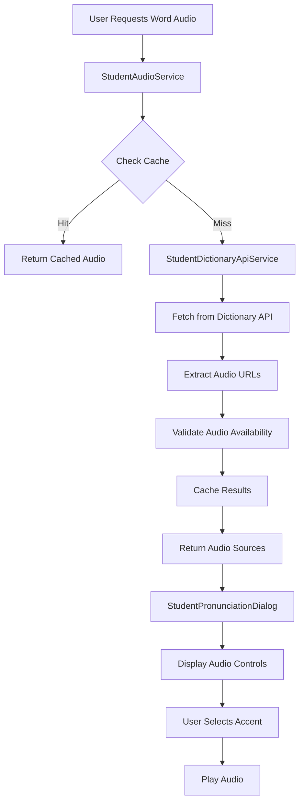

# Dictionary API Audio Integration Plan

## Overview

This plan outlines the integration of Dictionary API audio pronunciations into the online teaching dashboard, enhancing existing vocabulary features with dynamic audio support while maintaining current data structures.

## Project Goals

- **Hybrid Integration**: Enhance existing vocabulary words with Dictionary API audio while preserving current data structure
- **Caching Strategy**: Implement 24-48 hour caching to balance performance and data freshness
- **Comprehensive Coverage**: Integrate across all vocabulary-related features including vocabulary building, tasks, pronunciation practice, and word review sections
- **Fallback System**: Ensure graceful degradation when audio is unavailable

## Current State Analysis

### Existing Audio Implementation

- **Current Audio Source**: Static `audioUrl` field in vocabulary words from [`studentVocabularyService.js`](src/services/student-services/studentVocabularyService.js:78)
- **Audio Controls**: Implemented in [`StudentPronunciationDialog.js`](src/student-ui/students-pages/student-vocabulary-building-page/components/dialogs/StudentPronunciationDialog.js:474-483) with playback controls, volume, and speed adjustment
- **Speech Recognition**: Advanced pronunciation analysis in [`studentSpeechRecognitionService.js`](src/services/student-services/studentSpeechRecognitionService.js)
- **TTS Integration**: ElevenLabs service available in [`studentElevenlabsService.js`](src/services/student-services/studentElevenlabsService.js)

### Dictionary API URL Patterns

Based on provided examples, the API supports multiple pronunciation variants:

```
https://api.dictionaryapi.dev/media/pronunciations/en/{word}-1-uk.mp3
https://api.dictionaryapi.dev/media/pronunciations/en/{word}-au.mp3
https://api.dictionaryapi.dev/media/pronunciations/en/{word}-us.mp3
```

## Architecture Design

### 1. Dictionary API Service (`studentDictionaryApiService.js`)

```javascript
// Core service for Dictionary API integration
class StudentDictionaryApiService {
  // Fetch word data with pronunciation URLs
  async fetchWordData(word)

  // Try multiple audio URL patterns
  async findAvailableAudioUrls(word)

  // Cache management with expiration
  async getCachedWordData(word)
  async setCachedWordData(word, data, ttl)
}
```

**Key Features:**

- **URL Pattern Matching**: Automatically tries UK, US, AU variants
- **Response Caching**: 24-48 hour TTL using localStorage/IndexedDB
- **Error Handling**: Graceful fallbacks when API is unavailable
- **Rate Limiting**: Prevent excessive API calls

### 2. Enhanced Audio Service (`studentAudioService.js`)

```javascript
// Unified audio management service
class StudentAudioService {
  // Get best available audio URL for word
  async getAudioUrl(word, preferences = {})

  // Audio source priority management
  getPriorityAudioSources(word, preferences)

  // Preload audio for better UX
  async preloadAudio(urls)
}
```

**Audio Source Priority:**

1. Dictionary API (preferred accent)
2. Dictionary API (fallback accents)
3. Existing static `audioUrl`
4. ElevenLabs TTS (fallback)

### 3. Pronunciation Cache Service (`studentPronunciationCacheService.js`)

```javascript
// Caching layer for pronunciation data
class StudentPronunciationCacheService {
  // Cache with expiration
  async set(key, data, ttlHours = 48)
  async get(key)

  // Cache cleanup
  async cleanup()

  // Cache statistics
  getCacheStats()
}
```

## Implementation Plan

### Phase 1: Core Services Development

#### 1.1 Dictionary API Service

```javascript
// src/services/student-services/studentDictionaryApiService.js
const API_BASE = "https://api.dictionaryapi.dev/api/v2/entries/en";
const AUDIO_BASE = "https://api.dictionaryapi.dev/media/pronunciations/en";

class StudentDictionaryApiService {
  constructor() {
    this.cache = new Map();
    this.cacheExpiry = new Map();
  }

  async fetchWordData(word) {
    // Check cache first
    const cached = await this.getCachedData(word);
    if (cached) return cached;

    try {
      // Fetch from Dictionary API
      const response = await fetch(`${API_BASE}/${word}`);
      const data = await response.json();

      // Extract audio URLs and phonetics
      const audioUrls = this.extractAudioUrls(data, word);
      const phonetics = this.extractPhonetics(data);

      const result = {
        word,
        audioUrls,
        phonetics,
        definitions: data[0]?.meanings || [],
        timestamp: Date.now(),
      };

      // Cache the result
      await this.setCachedData(word, result);
      return result;
    } catch (error) {
      console.error("Dictionary API error:", error);
      return this.getFallbackData(word);
    }
  }

  extractAudioUrls(data, word) {
    const urls = [];

    // Extract from API response
    data[0]?.phonetics?.forEach((phonetic) => {
      if (phonetic.audio) {
        urls.push({
          url: phonetic.audio,
          accent: this.detectAccent(phonetic.audio),
          source: "api",
        });
      }
    });

    // Try common patterns if no audio found
    if (urls.length === 0) {
      const patterns = [
        `${AUDIO_BASE}/${word}-us.mp3`,
        `${AUDIO_BASE}/${word}-uk.mp3`,
        `${AUDIO_BASE}/${word}-au.mp3`,
        `${AUDIO_BASE}/${word}-1-uk.mp3`,
      ];

      patterns.forEach((url) => {
        urls.push({
          url,
          accent: this.detectAccent(url),
          source: "pattern",
        });
      });
    }

    return urls;
  }
}
```

#### 1.2 Enhanced Audio Service

```javascript
// src/services/student-services/studentAudioService.js
class StudentAudioService {
  constructor() {
    this.dictionaryApi = new StudentDictionaryApiService();
    this.preferences = this.loadPreferences();
  }

  async getAudioUrl(word, options = {}) {
    const sources = await this.getPriorityAudioSources(word, options);

    for (const source of sources) {
      if (await this.isAudioAvailable(source.url)) {
        return source;
      }
    }

    // Fallback to TTS
    return this.generateTTSAudio(word);
  }

  async getPriorityAudioSources(word, options) {
    const sources = [];

    // 1. Dictionary API sources
    const dictionaryData = await this.dictionaryApi.fetchWordData(word);
    if (dictionaryData?.audioUrls) {
      // Sort by user preference (US, UK, AU)
      const sortedUrls = this.sortByAccentPreference(
        dictionaryData.audioUrls,
        options.preferredAccent || this.preferences.accent
      );
      sources.push(...sortedUrls);
    }

    // 2. Existing static audio
    if (options.staticAudioUrl) {
      sources.push({
        url: options.staticAudioUrl,
        accent: "static",
        source: "static",
      });
    }

    return sources;
  }
}
```

### Phase 2: Component Integration

#### 2.1 Enhanced Pronunciation Dialog

Update [`StudentPronunciationDialog.js`](src/student-ui/students-pages/student-vocabulary-building-page/components/dialogs/StudentPronunciationDialog.js) to support multiple audio sources:

```javascript
// Enhanced pronunciation dialog with multiple audio sources
const StudentPronunciationDialog = ({ open, onClose, word }) => {
  const [audioSources, setAudioSources] = useState([]);
  const [currentAudioIndex, setCurrentAudioIndex] = useState(0);
  const [phoneticsData, setPhoneticsData] = useState(null);

  useEffect(() => {
    if (word && open) {
      loadAudioSources();
    }
  }, [word, open]);

  const loadAudioSources = async () => {
    const audioService = new StudentAudioService();
    const sources = await audioService.getPriorityAudioSources(word.word);
    setAudioSources(sources);

    // Load phonetics data
    const dictionaryData = await audioService.dictionaryApi.fetchWordData(
      word.word
    );
    setPhoneticsData(dictionaryData?.phonetics);
  };

  return (
    <Dialog open={open} onClose={onClose}>
      {/* Accent Selection */}
      <AccentSelector
        audioSources={audioSources}
        currentIndex={currentAudioIndex}
        onChange={setCurrentAudioIndex}
      />

      {/* Enhanced Phonetics Display */}
      <PhoneticsDisplay phonetics={phoneticsData} word={word.word} />

      {/* Audio Controls with Source Info */}
      <AudioControls
        audioUrl={audioSources[currentAudioIndex]?.url}
        sourceInfo={audioSources[currentAudioIndex]}
      />
    </Dialog>
  );
};
```

#### 2.2 Reusable Audio Components

```javascript
// src/components/audio/AccentSelector.js
const AccentSelector = ({ audioSources, currentIndex, onChange }) => {
  return (
    <FormControl>
      <InputLabel>Accent</InputLabel>
      <Select value={currentIndex} onChange={(e) => onChange(e.target.value)}>
        {audioSources.map((source, index) => (
          <MenuItem key={index} value={index}>
            {source.accent.toUpperCase()}
            {source.source === "api" && <VerifiedIcon />}
          </MenuItem>
        ))}
      </Select>
    </FormControl>
  );
};

// src/components/audio/PhoneticsDisplay.js
const PhoneticsDisplay = ({ phonetics, word }) => {
  return (
    <Box>
      <Typography variant="h3">{word}</Typography>
      {phonetics?.map((phonetic, index) => (
        <Typography key={index} variant="h6">
          /{phonetic.text}/
        </Typography>
      ))}
    </Box>
  );
};
```

### Phase 3: Integration Across Features

#### 3.1 Vocabulary Building Page

- Enhance [`StudentVocabularyBuildingPage.js`](src/student-ui/students-pages/student-vocabulary-building-page/StudentVocabularyBuildingPage.js) with new audio service
- Add accent preference settings
- Implement audio preloading for better UX

#### 3.2 Vocabulary Tasks Integration

- Update task components to include pronunciation audio
- Add audio hints for vocabulary questions
- Integrate with [`studentTaskService.js`](src/services/student-services/studentTaskService.js) for vocabulary tasks

#### 3.3 Word Review Sections

- Enhance review components with Dictionary API audio
- Add pronunciation practice to review sessions
- Implement spaced repetition with audio cues

### Phase 4: Advanced Features

#### 4.1 Pronunciation Preferences

```javascript
// User preferences for pronunciation
const PronunciationPreferences = {
  preferredAccent: "us", // 'us', 'uk', 'au'
  autoPlay: false,
  playbackSpeed: 1.0,
  showPhonetics: true,
  cacheAudio: true,
};
```

#### 4.2 Offline Support

- Cache audio files for offline use
- Implement service worker for audio caching
- Fallback to cached pronunciations when offline

#### 4.3 Analytics Integration

- Track pronunciation usage patterns
- Monitor audio source success rates
- Collect user accent preferences

## Data Flow Architecture



## Error Handling Strategy

### 1. API Failures

- **Network Issues**: Fallback to cached data
- **Rate Limiting**: Implement exponential backoff
- **Invalid Responses**: Use pattern-based URLs

### 2. Audio Loading Failures

- **404 Errors**: Try next audio source in priority list
- **CORS Issues**: Proxy through backend if needed
- **Format Issues**: Fallback to TTS generation

### 3. Cache Issues

- **Storage Full**: Implement LRU eviction
- **Corruption**: Clear and rebuild cache
- **Expiry**: Graceful refresh in background

## Performance Considerations

### 1. Caching Strategy

- **Memory Cache**: Recently accessed words (100 words max)
- **Persistent Cache**: IndexedDB for 48-hour TTL
- **Preloading**: Next/previous words in vocabulary lists

### 2. Network Optimization

- **Batch Requests**: Group multiple word lookups
- **Compression**: Use gzip for API responses
- **CDN**: Cache static audio files

### 3. User Experience

- **Progressive Loading**: Show UI immediately, load audio async
- **Preloading**: Load audio for likely next words
- **Feedback**: Show loading states and error messages

## Testing Strategy

### 1. Unit Tests

- Dictionary API service methods
- Audio URL pattern matching
- Cache expiration logic

### 2. Integration Tests

- End-to-end pronunciation flow
- Fallback scenarios
- Cross-component audio sharing

### 3. Performance Tests

- Cache hit/miss ratios
- Audio loading times
- Memory usage patterns

## Security Considerations

### 1. API Security

- **Rate Limiting**: Prevent abuse of Dictionary API
- **Input Validation**: Sanitize word inputs
- **HTTPS Only**: Ensure secure audio loading

### 2. Data Privacy

- **No Personal Data**: Don't cache user-specific info
- **Local Storage**: Keep pronunciation preferences local
- **Consent**: Ask before caching audio files

## Deployment Plan

### Phase 1: Core Services (Week 1-2)

- [ ] Implement Dictionary API service
- [ ] Create audio service with fallbacks
- [ ] Set up caching infrastructure

### Phase 2: UI Integration (Week 3-4)

- [ ] Update pronunciation dialog
- [ ] Create reusable audio components
- [ ] Integrate with vocabulary building

### Phase 3: Feature Expansion (Week 5-6)

- [ ] Add to vocabulary tasks
- [ ] Integrate with word reviews
- [ ] Implement user preferences

### Phase 4: Polish & Testing (Week 7-8)

- [ ] Performance optimization
- [ ] Comprehensive testing
- [ ] Documentation and training

## Success Metrics

### 1. Technical Metrics

- **Cache Hit Rate**: >80% for frequently accessed words
- **Audio Load Time**: <2 seconds average
- **API Success Rate**: >95% uptime

### 2. User Experience Metrics

- **Pronunciation Usage**: Increase in audio playback events
- **User Retention**: Improved engagement with vocabulary features
- **Error Rate**: <1% audio loading failures

### 3. Educational Metrics

- **Pronunciation Accuracy**: Improved speech recognition scores
- **Learning Outcomes**: Better vocabulary retention
- **Feature Adoption**: Usage across all vocabulary features

## Maintenance Plan

### 1. Regular Updates

- **API Monitoring**: Track Dictionary API changes
- **Cache Cleanup**: Automated expired data removal
- **Performance Monitoring**: Regular performance audits

### 2. User Feedback

- **Usage Analytics**: Monitor feature adoption
- **Error Reporting**: Automated error tracking
- **User Surveys**: Collect pronunciation preference feedback

### 3. Technical Debt

- **Code Reviews**: Regular architecture reviews
- **Refactoring**: Continuous improvement
- **Documentation**: Keep implementation docs updated

## Conclusion

This comprehensive plan provides a robust foundation for integrating Dictionary API audio pronunciations into the online teaching dashboard. The hybrid approach maintains existing functionality while significantly enhancing the pronunciation learning experience across all vocabulary-related features.

The implementation prioritizes performance, user experience, and maintainability while providing graceful fallbacks and comprehensive error handling. The phased approach ensures steady progress with measurable milestones and success criteria.
