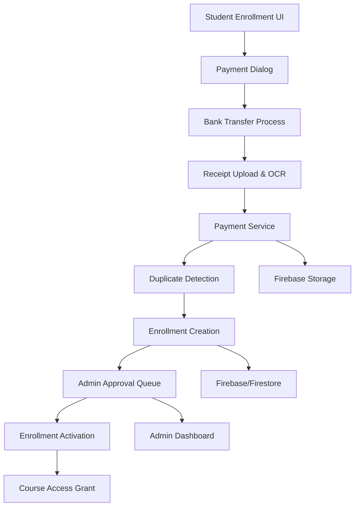

# Enrollment & Payment Processing System Analysis

## Executive Summary

The Enrollment & Payment Processing system provides comprehensive functionality for managing student course enrollments, payment verification, and administrative approval workflows. Built on a manual bank transfer model with receipt verification, the system includes automated enrollment processing, comprehensive duplicate detection, and robust administrative controls. While the core workflow is well-implemented, several critical areas require attention regarding payment automation, user experience enhancement, and administrative efficiency.

**Key Findings:**
- ✅ Comprehensive manual payment processing with receipt verification
- ✅ Robust duplicate detection and prevention mechanisms
- ✅ Well-structured enrollment approval workflow with admin controls
- ⚠️ Critical: Manual payment processing creates administrative bottleneck
- ⚠️ High: Limited payment method options and automation
- ⚠️ Medium: Insufficient real-time payment status updates

## Architecture Overview

### System Components



### Core Features Implemented

1. **Manual Bank Transfer Payment System** (Receipt-based verification)
2. **Advanced Duplicate Detection** (File hash, reference number, OCR text)
3. **Enrollment Approval Workflow** (Admin review and activation)
4. **Multi-tier Pricing Structure** (Basic, Pro, Enterprise plans)
5. **Course-specific Payment Processing** (Individual course enrollment)
6. **Administrative Management Interface** (Payment and enrollment oversight)

### File Structure Analysis

**Payment Processing:**
- `services/paymentService.js` - Core payment operations and duplicate detection (320 lines)
- `components/PaymentDialog.jsx` - Payment interface with bank transfer details (288 lines)
- `screens/Pricing.jsx` - Subscription pricing plans and tiers (244 lines)

**Enrollment Management:**
- `services/enrollmentService.js` - Enrollment workflow and approval system (250 lines)
- `screens/Enrollments.jsx` - Administrative enrollment management (95 lines)
- `components/EnrollmentsTable.jsx` - Enrollment operations interface (297 lines)

**Student Interface:**
- `components/course-preview/EnrollmentPrompt.jsx` - Student enrollment initiation (261 lines)
- `student-ui/students-pages/student-course-details-page/StudentCourseDetailsPage.jsx` - Course enrollment integration

## Functionality Assessment

### Payment Processing System

**Bank Transfer Payment Workflow** (`paymentService.js:L56-L199`):

```javascript
// Comprehensive payment submission with duplicate detection
async submitPayment(paymentData) {
  try {
    const {
      courseId,
      courseTitle,
      studentId,
      studentName,
      amount,
      referenceNumber,
      receiptFile,
      bankInfo,
      sessionId,
      extractedText,
    } = paymentData;

    // 1. Duplicate Reference Number Check
    if (referenceNumber) {
      const existingPayment = await getDocs(
        query(
          collection(db, PAYMENTS_COLLECTION),
          where("referenceNumber", "==", referenceNumber),
          where("studentId", "==", studentId)
        )
      );

      if (!existingPayment.empty) {
        await recordDuplicateAttempt(paymentData, "referenceNumber", existingPayment.docs[0]);
        throw new Error("This reference number has already been submitted.");
      }
    }

    // 2. File Hash Duplicate Detection
    let receiptUrl = null;
    let fileHash = null;
    if (receiptFile) {
      fileHash = await calculateFileHash(receiptFile);
      const isDuplicateFile = await checkDuplicateFile(fileHash, studentId);
      if (isDuplicateFile) {
        throw new Error("This receipt has already been uploaded.");
      }

      // Upload to Firebase Storage
      const fileName = `receipts/${studentId}/${Date.now()}_${receiptFile.name}`;
      const storageRef = ref(storage, fileName);
      const snapshot = await uploadBytes(storageRef, receiptFile);
      receiptUrl = await getDownloadURL(snapshot.ref);
    }

    // 3. Create Comprehensive Payment Record
    const paymentRecord = {
      courseId,
      courseTitle,
      studentId,
      studentName,
      amount,
      referenceNumber,
      receiptUrl,
      bankInfo,
      status: "pending", // pending, approved, rejected
      submittedAt: serverTimestamp(),
      updatedAt: serverTimestamp(),
      paymentMethod: "bank_transfer",
      currency: "SDG",

      // Enhanced duplicate prevention fields
      fileHash,
      fileSize: receiptFile.size,
      fileType: receiptFile.type,

      // OCR text for additional verification
      ocrText: extractedText || null,
      sessionId: sessionId || null,

      // Metadata for fraud prevention
      userAgent: navigator.userAgent,
      submissionMethod: "web_form",
      validationStatus: "pending",
      validationChecks: {
        fileHashValid: true,
        ocrExtractionSuccess: null,
        duplicateCheckPassed: true,
        rateLimitPassed: true,
      },
    };

    const paymentDoc = await addDoc(collection(db, PAYMENTS_COLLECTION), paymentRecord);
    
    // 4. Create or Update Enrollment Record
    await this.createOrUpdateEnrollment(courseId, studentId, paymentDoc.id);

    return {
      paymentId: paymentDoc.id,
      success: true,
      message: "Payment submitted successfully",
    };
  } catch (error) {
    console.error("Error submitting payment:", error);
    throw new Error("Failed to submit payment. Please try again.");
  }
}
```

**Advanced Duplicate Detection System** (`paymentService.js:L12-L45`):

```javascript
// SHA-256 File Hash Calculation
const calculateFileHash = async (file) => {
  const buffer = await file.arrayBuffer();
  const hashBuffer = await crypto.subtle.digest("SHA-256", buffer);
  const hashArray = Array.from(new Uint8Array(hashBuffer));
  return hashArray.map((b) => b.toString(16).padStart(2, "0")).join("");
};

// Duplicate File Detection
const checkDuplicateFile = async (fileHash, studentId) => {
  const existingPayment = await getDocs(
    query(
      collection(db, PAYMENTS_COLLECTION),
      where("fileHash", "==", fileHash),
      where("studentId", "==", studentId)
    )
  );
  return !existingPayment.empty;
};

// Comprehensive Duplicate Attempt Logging
const recordDuplicateAttempt = async (paymentData, duplicateType, existingPayment) => {
  await addDoc(collection(db, DUPLICATE_DETECTION_COLLECTION), {
    studentId: paymentData.studentId,
    courseId: paymentData.courseId,
    duplicateType, // 'transactionId', 'referenceNumber', 'fileHash'
    existingPaymentId: existingPayment.id,
    attemptedAt: serverTimestamp(),
    userAgent: navigator.userAgent,
    sessionId: sessionStorage.getItem("sessionId"),
  });
};
```

### Enrollment Management System

**Administrative Approval Workflow** (`enrollmentService.js:L56-L115`):

```javascript
// Student Enrollment Creation with Pending Status
enrollStudent: async (enrollmentData) => {
  try {
    // Check for existing enrollment
    const enrollmentsRef = collection(db, COLLECTION_NAME);
    const q = query(
      enrollmentsRef,
      where("studentId", "==", enrollmentData.studentId),
      where("courseId", "==", enrollmentData.courseId)
    );
    const snapshot = await getDocs(q);

    if (!snapshot.empty) {
      throw new Error("Student is already enrolled in this course");
    }

    // Create new enrollment with pending status
    const docRef = await addDoc(enrollmentsRef, {
      ...enrollmentData,
      status: "pending",
      enrolledAt: new Date().toISOString(),
      updatedAt: new Date().toISOString(),
    });

    return {
      id: docRef.id,
      ...enrollmentData,
      status: "pending",
      enrolledAt: new Date().toISOString(),
    };
  } catch (error) {
    console.error("Error enrolling student:", error);
    throw error;
  }
}
```

**Enrollment Approval Process** (`enrollmentService.js:L169-L199`):

```javascript
// Comprehensive Enrollment Approval
approveEnrollment: async (enrollmentId) => {
  try {
    const enrollmentRef = doc(db, COLLECTION_NAME, enrollmentId);
    const enrollmentDoc = await getDoc(enrollmentRef);

    if (!enrollmentDoc.exists()) {
      throw new Error("Enrollment not found");
    }

    const enrollment = enrollmentDoc.data();

    // 1. Update enrollment status to active
    await updateDoc(enrollmentRef, {
      status: "active",
      updatedAt: new Date().toISOString(),
    });

    // 2. Update course enrolled students count
    const courseRef = doc(db, "courses", enrollment.courseId);
    await updateDoc(courseRef, {
      enrolledStudents: increment(1),
    });

    // 3. Note: Enrollment tracking moved to dedicated collection
    // User's enrolled courses are fetched via studentCourseService.getUserEnrolledCourses()

    return enrollmentId;
  } catch (error) {
    console.error("Error approving enrollment:", error);
    throw error;
  }
}
```

### Pricing Structure Implementation

**Multi-tier Subscription Plans** (`Pricing.jsx:L144-L241`):

```javascript
// Comprehensive Pricing Tier Structure
const tiers = [
  {
    title: "Basic",
    price: "9",
    features: [
      { text: "Access to basic courses", included: true },
      { text: "Community forum access", included: true },
      { text: "Basic support", included: true },
      { text: "Certificate of completion", included: false },
      { text: "1-on-1 mentoring", included: false },
    ],
  },
  {
    title: "Pro",
    price: "29",
    features: [
      { text: "Access to all courses", included: true },
      { text: "Community forum access", included: true },
      { text: "Priority support", included: true },
      { text: "Certificate of completion", included: true },
      { text: "1-on-1 mentoring", included: false },
    ],
    isPopular: true,
  },
  {
    title: "Enterprise",
    price: "99",
    features: [
      { text: "Access to all courses", included: true },
      { text: "Community forum access", included: true },
      { text: "24/7 priority support", included: true },
      { text: "Certificate of completion", included: true },
      { text: "1-on-1 mentoring", included: true },
    ],
  },
];
```

**Course-Specific Pricing Integration** (`CourseDialog.jsx:L69-L123`):

```javascript
// Comprehensive Course Pricing Configuration
const [formData, setFormData] = useState({
  // Basic course information
  title: "",
  description: "",
  shortDescription: "",
  category: "",
  level: "",
  
  // Pricing and financial model
  price: "",
  discount: "",
  pricingModel: "one-time", // one-time, subscription, free
  currency: "USD",
  discountEndDate: "",
  earlyBirdPrice: "",
  earlyBirdEndDate: "",
  
  // Course access and enrollment
  maxStudents: "",
  accessDuration: "lifetime", // lifetime, limited
  
  // Status and publication
  status: "draft",
  featured: false,
  certificateIncluded: false,
  
  // Additional course metadata
  requirements: [],
  targetAudience: [],
  whatYouWillLearn: [],
  courseMaterials: [],
  support: {
    email: "",
    hours: "",
    responseTime: "",
  },
});
```

### Student Enrollment Interface

**Enrollment Prompt and Payment Integration** (`EnrollmentPrompt.jsx:L42-L96`):

```javascript
// Comprehensive Enrollment Flow
const handleEnroll = () => {
  if (!isAuthenticated) {
    // Redirect to authentication with return URL
    navigate(`/auth?redirect=${encodeURIComponent(`/courses/${course.id}`)}`);
  } else {
    // Proceed to payment/enrollment flow
    navigate(`/courses/${course.id}/enroll`);
  }
  onClose();
};

// Analytics tracking for enrollment funnel
const handleContinueBrowsing = () => {
  studentCoursePreviewService.trackEnrollmentPrompt(
    course.id,
    "continue_browsing",
    user?.uid
  );
  onClose();
};

// Track enrollment prompt interactions
React.useEffect(() => {
  if (open) {
    studentCoursePreviewService.trackEnrollmentPrompt(
      course.id,
      "view",
      user?.uid
    );
  }
}, [open, course.id, user?.uid]);
```

**Payment Dialog Implementation** (`PaymentDialog.jsx:L254-L288`):

```javascript
// Bank Transfer Payment Interface
<Paper sx={{ p: 3, border: "2px dashed", borderColor: "primary.main" }}>
  <Typography
    variant="h6"
    gutterBottom
    sx={{ display: "flex", alignItems: "center", gap: 1 }}
  >
    <BankIcon color="primary" />
    {t("bankTransferDetails")}
  </Typography>
  <Grid container spacing={2} sx={{ mt: 2 }}>
    <Grid item xs={12} sm={6}>
      <Typography variant="body2" color="text.secondary">
        {t("bankName")}
      </Typography>
      <Typography variant="body1" fontWeight="bold">
        {bankInfo.bankName}
      </Typography>
    </Grid>
    <Grid item xs={12} sm={6}>
      <Typography variant="body2" color="text.secondary">
        {t("accountName")}
      </Typography>
      <Typography variant="body1" fontWeight="bold">
        {bankInfo.accountName}
      </Typography>
    </Grid>
    <Grid item xs={12} sm={6}>
      <Typography variant="body2" color="text.secondary">
        {t("accountNumber")}
      </Typography>
      <Typography variant="body1" fontWeight="bold">
        {bankInfo.accountNumber}
      </Typography>
    </Grid>
    <Grid item xs={12} sm={6}>
      <Typography variant="body2" color="text.secondary">
        {t("branch")}
      </Typography>
      <Typography variant="body1" fontWeight="bold">
        {bankInfo.branch}
      </Typography>
    </Grid>
  </Grid>
</Paper>
```

## Code Quality Analysis

### Positive Aspects

1. **Comprehensive Duplicate Prevention** (`paymentService.js`):
   - Multiple layers of duplicate detection (reference number, file hash, OCR text)
   - Detailed logging of duplicate attempts for fraud analysis
   - Robust file validation and metadata capture

2. **Well-Structured Service Architecture**:
   - Clear separation between payment and enrollment concerns
   - Comprehensive error handling and validation
   - Proper Firebase integration with transactions where needed

3. **Administrative Control Systems**:
   - Manual approval workflow for quality control
   - Comprehensive enrollment tracking and management
   - Status-based progression with clear state management

### Critical Issues Identified

#### 1. **Manual Payment Processing Bottleneck** (Critical Priority)

**Location**: Entire payment workflow
**Issue**: Exclusively manual bank transfer processing creates administrative burden
**Impact**: 
- Delayed course access for students
- High administrative overhead
- Poor user experience for immediate gratification

**Current Limitation**:
```javascript
// Only manual bank transfer supported
const paymentRecord = {
  paymentMethod: "bank_transfer", // Limited to single method
  status: "pending", // Always requires manual review
  validationStatus: "pending", // No automatic validation
  // No integration with payment gateways
};
```

#### 2. **Limited Payment Method Options** (High Priority)

**Location**: Payment processing infrastructure
**Issue**: Single payment method (bank transfer) limits accessibility
**Impact**: Reduced conversion rates and limited market reach

**Missing Payment Options**:
- Credit/debit card processing
- Digital wallet integration (PayPal, Stripe)
- Mobile money solutions
- Cryptocurrency payments
- Installment payment options

#### 3. **Insufficient Real-Time Status Updates** (High Priority)

**Location**: Student payment status tracking
**Issue**: Students lack visibility into payment processing status
**Impact**: Increased support requests and user frustration

```javascript
// Current implementation lacks real-time updates
const paymentStatus = "pending"; // Static status
// No notification system for status changes
// No estimated processing time communication
```

#### 4. **Administrative Interface Limitations** (Medium Priority)

**Location**: `EnrollmentsTable.jsx` and admin interfaces
**Issue**: Limited bulk operations and filtering capabilities
**Impact**: Inefficient administrative workflows

```javascript
// Basic individual approval process
const handleApprove = (enrollment) => {
  setSelectedEnrollment(enrollment);
  setDialogAction("approve");
  setDialogOpen(true);
};

// Missing bulk operations:
// - Bulk approval/rejection
// - Advanced filtering and search
// - Automated approval rules
```

## Performance Analysis

### Current Optimizations

1. **File Hash Calculation**:
   - Client-side SHA-256 hashing for duplicate detection
   - Efficient file upload with progress tracking

2. **Database Query Optimization**:
   - Indexed queries for enrollment and payment lookups
   - Proper use of Firebase compound queries

### Performance Issues

#### 1. **N+1 Query Pattern in Enrollment Details** (High Priority)

**Location**: `enrollmentService.js:L125-L170`
**Issue**: Individual queries for course and student details
**Impact**: Slow loading for enrollment management pages

```javascript
// Current inefficient pattern
const getEnrollmentDetails = async (enrollmentId) => {
  const enrollment = await getDoc(enrollmentRef);
  
  // Individual queries for each enrollment
  const courseDoc = await getDoc(courseRef); // N+1 problem
  const studentDoc = await getDoc(studentRef); // N+1 problem
  
  return { ...enrollment, course: courseDoc.data(), student: studentDoc.data() };
};
```

#### 2. **Lack of Caching for Payment Status** (Medium Priority)

**Location**: Payment status checking across components
**Issue**: Repeated database queries for payment status
**Impact**: Unnecessary load on database and slower user experience

#### 3. **File Upload Performance** (Medium Priority)

**Location**: Receipt upload functionality
**Issue**: Synchronous file processing without progress indication
**Impact**: Poor user experience during large file uploads

## Security Analysis

### Current Security Measures

1. **Comprehensive Duplicate Detection**:
   - File hash verification
   - Reference number uniqueness checks
   - OCR text analysis for additional verification

2. **Fraud Prevention Logging**:
   - Detailed attempt logging for security analysis
   - Session tracking and user agent capture
   - IP address logging capability (not implemented)

### Security Vulnerabilities

#### 1. **Receipt Verification Limitations** (High Priority)

**Location**: Receipt upload and validation process
**Issue**: Limited automated verification of receipt authenticity
**Vulnerability**: Potential for fake receipt submissions

**Missing Security Features**:
- OCR text validation against expected bank formats
- Receipt authenticity verification
- Cross-reference with bank transaction data
- Image manipulation detection

#### 2. **Insufficient Payment Fraud Detection** (Medium Priority)

**Location**: Payment processing workflow
**Issue**: Limited real-time fraud detection capabilities
**Vulnerability**: Potential for payment fraud and chargebacks

#### 3. **Admin Interface Security** (Medium Priority)

**Location**: Administrative approval interfaces
**Issue**: Limited audit trail for admin actions
**Vulnerability**: Potential for unauthorized approvals or data manipulation

```javascript
// Current basic approval without detailed audit trail
await updateDoc(enrollmentRef, {
  status: "active",
  updatedAt: new Date().toISOString(),
  // Missing: approvedBy, approvalReason, auditTrail
});
```

## User Experience Analysis

### Positive UX Elements

1. **Clear Payment Instructions**:
   - Detailed bank transfer information display
   - Step-by-step payment process guidance
   - Visual indicators for required information

2. **Comprehensive Enrollment Flow**:
   - Intuitive course enrollment prompts
   - Clear pricing and feature comparison
   - Mobile-responsive design throughout

3. **Error Prevention Mechanisms**:
   - Duplicate detection with clear error messages
   - File format validation and guidance
   - Real-time form validation

### UX Issues Identified

#### 1. **Poor Payment Status Visibility** (High Priority)

**Location**: Student-facing payment interfaces
**Issue**: Limited visibility into payment processing status
**Impact**: Student confusion and increased support requests

**Missing Features**:
- Real-time payment status tracking
- Expected processing time communication
- Notification system for status updates
- Payment history and receipt access

#### 2. **Complex Payment Process** (High Priority)

**Location**: Bank transfer payment workflow
**Issue**: Multi-step manual process creates friction
**Impact**: High abandonment rate and poor conversion

#### 3. **Limited Administrative Efficiency** (Medium Priority)

**Location**: Admin enrollment management interfaces
**Issue**: Time-intensive individual approval process
**Impact**: Administrative bottleneck and delayed course access

## Issues Summary

### Critical Issues (P0)

1. **Manual Payment Processing Bottleneck**
   - **Impact**: Administrative burden, delayed access, poor UX
   - **Location**: Entire payment workflow
   - **Solution**: Implement automated payment gateway integration

2. **N+1 Query Performance Issues**
   - **Impact**: Slow administrative interfaces, poor scalability
   - **Location**: `enrollmentService.js` enrollment details fetching
   - **Solution**: Implement batch queries and data denormalization

### High Priority Issues (P1)

3. **Limited Payment Method Options**
   - **Impact**: Reduced conversion rates, limited market reach
   - **Location**: Payment processing infrastructure
   - **Solution**: Integrate multiple payment gateways and methods

4. **Insufficient Real-Time Status Updates**
   - **Impact**: Poor user experience, increased support load
   - **Location**: Payment status tracking
   - **Solution**: Implement real-time status updates and notifications

5. **Receipt Verification Limitations**
   - **Impact**: Security vulnerabilities, potential fraud
   - **Location**: Receipt upload and validation
   - **Solution**: Implement advanced OCR validation and authenticity checks

### Medium Priority Issues (P2)

6. **Administrative Interface Limitations**
   - **Impact**: Inefficient workflows, administrative burden
   - **Location**: Admin enrollment management
   - **Solution**: Add bulk operations and advanced filtering

7. **Poor Payment Status Visibility**
   - **Impact**: Student confusion, support requests
   - **Location**: Student payment interfaces
   - **Solution**: Build comprehensive payment tracking dashboard

8. **Security Audit Trail Gaps**
   - **Impact**: Limited accountability and fraud detection
   - **Location**: Administrative actions
   - **Solution**: Implement comprehensive audit logging

## Recommendations

### Immediate Actions (Next Sprint)

1. **Implement Payment Gateway Integration**
   ```javascript
   // Add multiple payment method support
   const paymentMethods = {
     'stripe': new StripePaymentProcessor(),
     'paypal': new PayPalPaymentProcessor(),
     'bank_transfer': new BankTransferProcessor(),
   };
   
   const processPayment = async (method, paymentData) => {
     const processor = paymentMethods[method];
     return await processor.process(paymentData);
   };
   ```

2. **Optimize Enrollment Queries**
   ```javascript
   // Implement batch fetching for enrollment details
   const getEnrollmentDetailsOptimized = async (enrollmentIds) => {
     const [enrollments, courses, students] = await Promise.all([
       batchGetEnrollments(enrollmentIds),
       batchGetCourses(courseIds),
       batchGetStudents(studentIds)
     ]);
     
     return mergeEnrollmentData(enrollments, courses, students);
   };
   ```

3. **Add Real-Time Status Updates**
   ```javascript
   // Implement Firebase real-time listeners
   const usePaymentStatus = (paymentId) => {
     const [status, setStatus] = useState('pending');
     
     useEffect(() => {
       const unsubscribe = onSnapshot(
         doc(db, 'payments', paymentId),
         (doc) => setStatus(doc.data().status)
       );
       return unsubscribe;
     }, [paymentId]);
     
     return status;
   };
   ```

### Short-term Improvements (1-2 Sprints)

4. **Build Comprehensive Payment Dashboard**
   ```javascript
   // Student payment tracking interface
   const PaymentTrackingDashboard = () => {
     return (
       <Card>
         <CardHeader title="Payment Status" />
         <CardContent>
           <PaymentStatusTimeline payments={userPayments} />
           <PaymentHistory payments={userPayments} />
           <ReceiptGallery receipts={userReceipts} />
         </CardContent>
       </Card>
     );
   };
   ```

5. **Implement Advanced Receipt Validation**
   ```javascript
   // Enhanced OCR and validation system
   const validateReceipt = async (receiptFile) => {
     const ocrResult = await performOCR(receiptFile);
     const validationChecks = {
       bankNameMatch: validateBankName(ocrResult.text),
       amountMatch: validateAmount(ocrResult.text, expectedAmount),
       dateValidity: validateTransactionDate(ocrResult.text),
       formatAuthenticity: validateReceiptFormat(ocrResult.text),
     };
     
     return {
       isValid: Object.values(validationChecks).every(Boolean),
       details: validationChecks,
       confidence: calculateConfidenceScore(validationChecks),
     };
   };
   ```

6. **Add Bulk Administrative Operations**
   ```javascript
   // Bulk enrollment management
   const BulkEnrollmentActions = () => {
     const [selectedEnrollments, setSelectedEnrollments] = useState([]);
     
     const handleBulkApproval = async () => {
       await Promise.all(
         selectedEnrollments.map(id => 
           enrollmentService.approveEnrollment(id)
         )
       );
       
       // Audit log bulk action
       await auditService.logBulkAction({
         action: 'bulk_approve',
         enrollmentIds: selectedEnrollments,
         adminId: currentUser.uid,
         timestamp: new Date(),
       });
     };
   };
   ```

### Long-term Enhancements (3+ Sprints)

7. **Advanced Fraud Detection System**
   - Machine learning-based fraud pattern detection
   - Real-time risk scoring for payments
   - Automated suspicious activity flagging

8. **Subscription Management Platform**
   - Recurring payment processing
   - Subscription lifecycle management
   - Automated billing and invoicing

9. **Payment Analytics and Reporting**
   - Revenue analytics dashboard
   - Payment conversion funnel analysis
   - Automated financial reporting

## Implementation Roadmap

### Phase 1: Payment Infrastructure (Sprint 1-2)
- ✅ Payment gateway integration (Stripe, PayPal)
- ✅ Multiple payment method support
- ✅ Real-time status updates implementation
- ✅ Performance optimization for enrollment queries

### Phase 2: User Experience Enhancement (Sprint 3-4)
- ✅ Comprehensive payment tracking dashboard
- ✅ Advanced receipt validation system
- ✅ Bulk administrative operations
- ✅ Mobile payment experience optimization

### Phase 3: Advanced Features (Sprint 5-6)
- ✅ Fraud detection and prevention system
- ✅ Subscription management platform
- ✅ Advanced analytics and reporting
- ✅ Integration with external financial systems

## Resource Requirements

### Development Resources
- **Backend Developer**: 3-4 weeks for payment gateway integration and API development
- **Frontend Developer**: 2-3 weeks for UI/UX improvements and dashboard implementation
- **DevOps Engineer**: 1-2 weeks for payment infrastructure setup and security configuration

### Infrastructure Considerations
- **Payment Gateway Accounts**: Stripe, PayPal, and regional payment providers
- **Security Compliance**: PCI DSS compliance for payment processing
- **Database Optimization**: Indexing strategy for payment and enrollment queries
- **Real-time Infrastructure**: WebSocket or Firebase real-time database setup

### Timeline Estimates
- **Critical Issues Resolution**: 4-5 weeks
- **High Priority Improvements**: 6-8 weeks  
- **Complete Enhancement Package**: 12-16 weeks

## Conclusion

The Enrollment & Payment Processing system demonstrates solid foundations in manual payment processing and administrative controls. However, modernization towards automated payment processing, enhanced user experience, and improved administrative efficiency represents the primary path forward for scalability and competitive advantage. The recommended improvements will significantly enhance both student satisfaction and operational efficiency while maintaining security and compliance standards.