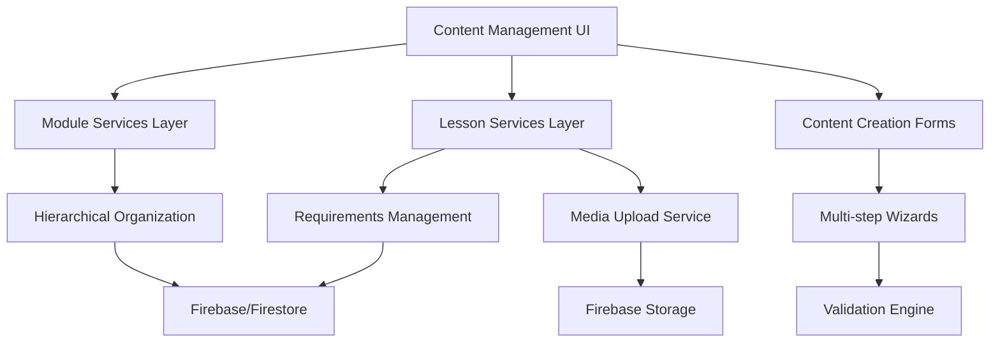

# Lesson & Content Management System Analysis

## Executive Summary

The Lesson & Content Management system provides comprehensive functionality for creating, organizing, and managing educational content within the online teaching platform. Built on a hierarchical course → module → lesson structure, the system offers sophisticated content creation workflows, multimedia support, and learning requirements management. While the foundation is robust, several critical areas require immediate attention to improve user experience, performance, and content consistency.

**Key Findings:**
- ✅ Comprehensive content creation with multimedia support
- ✅ Hierarchical content organization (Course → Module → Lesson)
- ✅ Advanced lesson requirements and completion tracking
- ⚠️ Critical: Overly complex lesson creation interface (2500+ lines)
- ⚠️ High: Missing content validation and preview features
- ⚠️ Medium: Performance issues with large content datasets

## Architecture Overview

### System Components



### Core Features Implemented

1. **Lesson Creation & Management** (`CreateLessonForm.jsx`, `lessonService.js`)
2. **Module Organization** (`CreateModuleForm.jsx`, `moduleService.js`)
3. **Content Requirements System** (Advanced completion tracking)
4. **Multimedia Content Support** (Video, Audio, Images, Documents)
5. **Hierarchical Content Structure** (Course-Module-Lesson relationship)
6. **Draft Management** (Local storage for unsaved content)

### File Structure Analysis

**Primary Components:**
- `components/CreateLessonForm.jsx` - Comprehensive lesson creation interface (2544 lines)
- `components/CreateModuleForm.jsx` - Module creation and editing form (260 lines)
- `services/lessonService.js` - Core lesson operations and requirements (466 lines)
- `services/moduleService.js` - Module management operations (162 lines)
- `services/student-services/studentLessonService.js` - Student-facing lesson service

**Management Interfaces:**
- `screens/CourseDetailsScreen.jsx` - Unified content management dashboard
- `components/lesson/management/` - Specialized lesson management components

## Functionality Assessment

### Lesson Creation System

**Multi-step Creation Workflow** (`CreateLessonForm.jsx:L874-L2475`):

```javascript
// 5-step lesson creation process
const steps = ["Basic Info", "Content", "Media", "Requirements", "Review"];

const renderStepContent = (step) => {
  switch (step) {
    case 0: // Basic Info: Title, description, vocabulary, grammar, skills
    case 1: // Content: Main content, objectives, resources
    case 2: // Media: Video, audio, images, materials upload
    case 3: // Requirements: Completion requirements configuration
    case 4: // Review: Preview and final submission
  }
};
```

**Advanced Features:**
- **Vocabulary Management**: Dynamic addition/removal of vocabulary terms
- **Grammar Focus**: Specialized grammar points tracking
- **Learning Objectives**: Required objectives with validation
- **Multimedia Integration**: Video, audio, image, and document support
- **Requirements Engine**: Customizable completion requirements

**Content Validation** (`CreateLessonForm.jsx:L770-L828`):
```javascript
const validateStep = () => {
  const newErrors = {};
  
  switch (activeStep) {
    case 0:
      if (!formData.title) newErrors.title = "Title is required";
      if (!formData.description) newErrors.description = "Description is required";
      if (!formData.duration) newErrors.duration = "Duration is required";
      break;
    case 1:
      if (!formData.content) newErrors.content = "Content is required";
      if (formData.objectives.length === 0) newErrors.objectives = "At least one objective is required";
      break;
    // Additional validation steps...
  }
  
  return Object.keys(newErrors).length === 0;
};
```

### Module Management System

**Module Creation Interface** (`CreateModuleForm.jsx:L85-L199`):

```javascript
const CreateModuleForm = ({
  open,
  onClose,
  onSubmit,
  courseId,
  initialData = {},
}) => {
  const [formData, setFormData] = useState({
    title: "",
    description: "",
    objectives: [],
    order: 0,
    duration: "",
    status: "draft",
    difficulty: "beginner",
    estimatedTime: "",
    ...initialData,
  });

  const handleAddObjective = () => {
    if (newObjective.trim()) {
      setFormData((prev) => ({
        ...prev,
        objectives: [...prev.objectives, newObjective.trim()],
      }));
      setNewObjective("");
    }
  };
};
```

**Module Service Operations** (`moduleService.js:L92-L146`):
```javascript
// Create module with comprehensive data structure
async createModule(courseId, moduleData) {
  try {
    const modulesRef = collection(db, "modules");
    const newModule = {
      ...moduleData,
      courseId,
      createdAt: serverTimestamp(),
      updatedAt: serverTimestamp(),
    };
    const docRef = await addDoc(modulesRef, newModule);
    return {
      id: docRef.id,
      ...newModule,
    };
  } catch (error) {
    console.error("Error creating module:", error);
    throw error;
  }
}
```

### Content Requirements System

**Advanced Requirements Management** (`lessonService.js:L103-L143`):

```javascript
export const createLessonRequirements = async (lessonId, requirements) => {
  try {
    const requirementsData = {
      lessonId,
      enabled: true,
      requiredTasks: requirements.requiredTasks || [],
      minimumScore: requirements.minimumScore || 70,
      requiredContent: requirements.requiredContent || [],
      requiredTimeSpent: requirements.requiredTimeSpent || 0,
      requireVideoCompletion: requirements.requireVideoCompletion || false,
      requireAudioCompletion: requirements.requireAudioCompletion || false,
      requireReadingCompletion: requirements.requireReadingCompletion || false,
      requireTaskCompletion: requirements.requireTaskCompletion || false,
      createdAt: serverTimestamp(),
      updatedAt: serverTimestamp(),
    };

    await setDoc(requirementsRef, requirementsData);
    return { id: lessonId, ...requirementsData };
  } catch (error) {
    throw new Error(`Failed to create lesson requirements: ${error.message}`);
  }
};
```

**Requirements Configuration Interface** (`CreateLessonForm.jsx:L1950-L2180`):
- Toggle-based requirements activation
- Configurable completion options (video, audio, reading, tasks)
- Minimum score and time requirements
- Dynamic task and content requirement lists

### Media Management Integration

**File Upload Handling** (`CreateLessonForm.jsx:L293-L324`):

```javascript
const handleFileChange = (field) => async (event) => {
  const files = event.target.files;
  if (!files || files.length === 0) return;

  setLoading(true);
  try {
    if (field === "materials") {
      const uploadedFiles = await uploadMultipleFiles(
        Array.from(files),
        `courses/${courseId}/modules/${moduleId}/materials`
      );
      setFormData((prev) => ({
        ...prev,
        materials: [...prev.materials, ...uploadedFiles],
      }));
    } else {
      const uploadedFile = await uploadFile(
        files[0],
        `courses/${courseId}/modules/${moduleId}/${field}`
      );
      setFormData((prev) => ({
        ...prev,
        [field]: uploadedFile,
      }));
    }
  } catch (error) {
    // Error handling
  } finally {
    setLoading(false);
  }
};
```

## Code Quality Analysis

### Positive Aspects

1. **Comprehensive Data Modeling** (`lessonService.js:L18-L95`):
   ```javascript
   // Extensive lesson data structure
   const lessonRef = await addDoc(collection(db, "lessons"), {
     moduleId,
     courseId,
     title,
     description,
     content,
     order,
     objectives,
     resources,
     videoUrl,
     attachments,
     quizId,
     taskId,
     duration,
     status,
     prerequisites,
     coverImageUrl,
     authorId,
     discussionId,
     tags,
     isFreePreview,
     visibility,
     vocabulary,
     grammarFocus,
     skills,
     assessment,
     keyActivities,
     createdAt: serverTimestamp(),
     updatedAt: serverTimestamp(),
   });
   ```

2. **Robust Service Layer Architecture**:
   - Comprehensive error handling
   - Transaction support for data integrity
   - Proper Firebase integration patterns

3. **Advanced Form Management**:
   - Multi-step wizard implementation
   - Draft saving functionality
   - Real-time validation

### Critical Issues Identified

#### 1. **Overly Complex Component Structure** (Critical Priority)

**Location**: `CreateLessonForm.jsx` (2544 lines)
**Issue**: Single component handling entire lesson creation workflow
**Impact**: 
- Difficult maintenance and debugging
- Poor performance due to large component size
- Complex state management

**Code Example**:
```javascript
// Single component with 25+ state variables
const [formData, setFormData] = useState({
  courseId: courseId || initialData.courseId || "",
  moduleId: moduleId || initialData.moduleId || "",
  title: initialData.title || "",
  description: initialData.description || "",
  content: initialData.content || "",
  duration: initialData.duration || "",
  objectives: initialData.objectives || [],
  resources: initialData.resources || [],
  // ... 15+ more fields
});
```

#### 2. **Missing Content Validation Engine** (High Priority)

**Location**: Lesson creation workflow
**Issue**: Limited content validation and preview capabilities
**Impact**: Content quality inconsistency and publishing errors

**Current Limitation**:
```javascript
// Basic validation only
const validateStep = () => {
  const newErrors = {};
  if (!formData.title) newErrors.title = "Title is required";
  if (!formData.description) newErrors.description = "Description is required";
  // Missing: content structure, media format, accessibility validation
};
```

#### 3. **Performance Issues with Large Content** (High Priority)

**Location**: `lessonService.js:L330-L374`
**Issue**: N+1 queries for lesson retrieval with module relationships
**Impact**: Slow loading for content-heavy courses

```javascript
// Inefficient lesson retrieval
export const getLessonsByCourseAndModule = async (courseId, moduleId) => {
  try {
    const lessonsQuery = query(
      collection(db, "lessons"),
      where("courseId", "==", courseId),
      where("moduleId", "==", moduleId),
      where("type", "==", "lesson"),
      orderBy("order", "asc")
    );
    // Individual queries for each lesson's related data
    const snapshot = await getDocs(lessonsQuery);
    const lessons = snapshot.docs.map((doc) => ({ id: doc.id, ...doc.data() }));
    return lessons;
  } catch (error) {
    throw new Error("Failed to get lessons: " + error.message);
  }
};
```

#### 4. **Inconsistent State Management** (Medium Priority)

**Location**: Form components and services
**Issue**: Mixed state management patterns across components
**Impact**: Data synchronization issues and unpredictable behavior

### Architecture Concerns

#### 1. **Missing Content Versioning** (Medium Priority)
- No content history tracking
- No rollback capabilities for published content
- Missing audit trail for content changes

#### 2. **Limited Content Reusability** (Medium Priority)
- No content templates or reusable components
- No cross-course content sharing mechanisms
- Missing content library functionality

#### 3. **Inadequate Content Analytics** (Low Priority)
- No content performance tracking
- Missing engagement metrics
- No content optimization recommendations

## User Experience Analysis

### Positive UX Elements

1. **Multi-step Wizard Design**:
   - Clear progress indication
   - Logical content organization
   - Step-by-step validation

2. **Rich Media Support**:
   - Drag-and-drop file uploads
   - Real-time media previews
   - Multiple format support

3. **Draft Management**:
   - Automatic draft saving
   - Recovery from unexpected closure
   - Cross-session persistence

### UX Issues Identified

#### 1. **Cognitive Overload in Lesson Creation** (High Priority)

**Location**: `CreateLessonForm.jsx` Step 0 (Basic Info)
**Issue**: Too many fields presented simultaneously
**Impact**: User overwhelm and form abandonment

```javascript
// Step 0 contains 10+ input fields simultaneously:
// Title, Description, Duration, Order, Vocabulary, Grammar, Skills, Assessment, Activities
```

#### 2. **Missing Content Preview Functionality** (High Priority)

**Location**: Review step implementation
**Issue**: Static preview without interactive elements
**Impact**: Cannot validate content effectiveness before publishing

#### 3. **Poor Error Communication** (Medium Priority)

**Location**: File upload and validation processes
**Issue**: Generic error messages and lack of recovery guidance
**Impact**: User frustration and abandonment

```javascript
// Generic error handling
} catch (error) {
  setError(err.message || t("createLessonForm.errorSaving"));
  // No specific guidance or recovery options
}
```

## Performance Analysis

### Current Optimizations

1. **Pagination Support** (`moduleService.js`):
   - Memory-based sorting for modules
   - Efficient lesson ordering

2. **Firebase Integration**:
   - Server timestamps for consistency
   - Proper indexing strategies

### Performance Bottlenecks

#### 1. **Large Form Rendering** (High Priority)

**Location**: `CreateLessonForm.jsx` render methods
**Issue**: Complex DOM tree with 2500+ lines of JSX
**Impact**: Slow initial rendering and interaction lag

#### 2. **Inefficient Media Loading** (Medium Priority)

**Location**: Media upload and preview functionality
**Issue**: No progressive loading or lazy evaluation
**Impact**: Slow form interactions when media is present

#### 3. **Missing Content Caching** (Medium Priority)

**Location**: Content retrieval services
**Issue**: No caching strategy for frequently accessed content
**Impact**: Repeated API calls for same content

## Security Considerations

### Current Security Measures

1. **Access Control**:
   - Course ownership validation
   - Role-based content creation permissions

2. **Data Validation**:
   - Required field validation
   - Type checking for numeric inputs

### Security Gaps

#### 1. **Content Sanitization** (High Priority)

**Location**: Content creation and update flows
**Issue**: Limited input sanitization for rich content
**Vulnerability**: XSS attacks through content injection

#### 2. **File Upload Security** (Medium Priority)

**Location**: Media upload functionality
**Issue**: Limited file type and size validation
**Vulnerability**: Malicious file uploads

#### 3. **Access Control Granularity** (Medium Priority)

**Location**: Lesson and module management
**Issue**: Coarse-grained permission system
**Impact**: Potential unauthorized content access

## Integration Assessment

### Service Integration Quality

1. **Firebase Integration** (`lessonService.js`):
   - ✅ Proper Firestore operations
   - ✅ Transaction support for data integrity
   - ✅ Server timestamp usage

2. **Storage Integration**:
   - ✅ File upload to Firebase Storage
   - ✅ URL generation and management
   - ⚠️ Limited file validation

3. **Cross-service Communication**:
   - ✅ Course-Module-Lesson hierarchy maintenance
   - ⚠️ Some circular dependencies between services

### Integration Issues

#### 1. **Service Coupling** (Medium Priority)

**Location**: Course and lesson services
**Issue**: Tight coupling between course and lesson management
**Impact**: Difficult to modify one without affecting others

#### 2. **Data Consistency Challenges** (Medium Priority)

**Location**: Module and lesson relationship management
**Issue**: Manual relationship maintenance across collections
**Impact**: Potential data integrity issues

## Issues Summary

### Critical Issues (P0)

1. **Overly Complex Lesson Creation Component**
   - **Impact**: Maintenance nightmare, poor performance, difficult debugging
   - **Location**: `CreateLessonForm.jsx` (2544 lines)
   - **Solution**: Break into smaller, focused components with shared state management

2. **Missing Content Validation Engine**
   - **Impact**: Inconsistent content quality, publishing errors
   - **Location**: Content creation workflows
   - **Solution**: Implement comprehensive validation with accessibility checks

### High Priority Issues (P1)

3. **Performance Issues with Large Content Datasets**
   - **Impact**: Slow loading times, poor user experience
   - **Location**: `lessonService.js` query operations
   - **Solution**: Implement pagination, caching, and batch operations

4. **Cognitive Overload in User Interface**
   - **Impact**: User confusion, form abandonment
   - **Location**: `CreateLessonForm.jsx` form design
   - **Solution**: Redesign with progressive disclosure and smart defaults

5. **Missing Content Preview Functionality**
   - **Impact**: Cannot validate content before publishing
   - **Location**: Review step implementation
   - **Solution**: Build interactive preview with student perspective

### Medium Priority Issues (P2)

6. **Inconsistent State Management Patterns**
   - **Impact**: Data synchronization issues, unpredictable behavior
   - **Location**: Form components and services
   - **Solution**: Standardize state management approach (Context API or Redux)

7. **Limited Content Reusability Features**
   - **Impact**: Inefficient content creation, duplication
   - **Location**: Content creation workflows
   - **Solution**: Implement content templates and reusable components library

8. **Security Gaps in Content Handling**
   - **Impact**: Potential XSS vulnerabilities, unauthorized access
   - **Location**: Content creation and file upload
   - **Solution**: Implement comprehensive input sanitization and validation

### Low Priority Issues (P3)

9. **Missing Content Versioning System**
   - **Impact**: No audit trail, cannot rollback changes
   - **Location**: Content update operations
   - **Solution**: Implement version control for content changes

10. **Limited Content Analytics Integration**
    - **Impact**: No data-driven content optimization
    - **Location**: Content management dashboard
    - **Solution**: Add content performance tracking and recommendations

## Recommendations

### Immediate Actions (Next Sprint)

1. **Refactor Lesson Creation Component**
   ```javascript
   // Break into smaller components
   const LessonBasicInfo = ({ formData, onChange, errors }) => { ... };
   const LessonContent = ({ formData, onChange, errors }) => { ... };
   const LessonMedia = ({ formData, onChange, loading }) => { ... };
   const LessonRequirements = ({ requirements, onChange }) => { ... };
   const LessonPreview = ({ lessonData }) => { ... };
   
   // Main component becomes orchestrator
   const CreateLessonWizard = () => {
     const { currentStep, nextStep, prevStep } = useWizard();
     return (
       <Stepper activeStep={currentStep}>
         {renderCurrentStep()}
       </Stepper>
     );
   };
   ```

2. **Implement Content Validation Engine**
   ```javascript
   const contentValidator = {
     validateStructure: (content) => {
       // Check content organization, readability
     },
     validateAccessibility: (content) => {
       // Check accessibility compliance
     },
     validateMedia: (media) => {
       // Validate file formats, sizes, quality
     },
     generateReport: (validationResults) => {
       // Provide actionable improvement suggestions
     }
   };
   ```

3. **Add Performance Optimizations**
   ```javascript
   // Implement pagination for large content lists
   const usePaginatedLessons = (courseId, moduleId) => {
     return useQuery({
       queryKey: ['lessons', courseId, moduleId],
       queryFn: () => getLessonsPaginated(courseId, moduleId),
       staleTime: 5 * 60 * 1000, // 5 minutes cache
     });
   };
   ```

### Short-term Improvements (1-2 Sprints)

4. **Redesign Content Creation UX**
   ```javascript
   // Progressive disclosure pattern
   const SmartLessonForm = () => {
     const [expandedSections, setExpandedSections] = useState(['basic']);
     
     return (
       <Accordion>
         <AccordionSection 
           title="Basic Information" 
           expanded={expandedSections.includes('basic')}
           required
         >
           <BasicInfoFields />
         </AccordionSection>
         <AccordionSection 
           title="Advanced Options" 
           expanded={expandedSections.includes('advanced')}
         >
           <AdvancedFields />
         </AccordionSection>
       </Accordion>
     );
   };
   ```

5. **Build Interactive Content Preview**
   ```javascript
   const LessonPreview = ({ lessonData }) => {
     return (
       <StudentViewSimulator>
         <LessonHeader lesson={lessonData} />
         <LessonContent content={lessonData.content} />
         <LessonMedia media={lessonData.media} />
         <LessonRequirements requirements={lessonData.requirements} />
         <ProgressTracker lesson={lessonData} />
       </StudentViewSimulator>
     );
   };
   ```

6. **Implement Content Templates System**
   ```javascript
   const ContentTemplateEngine = {
     createTemplate: (templateData) => {
       // Create reusable content template
     },
     applyTemplate: (templateId, customData) => {
       // Apply template with customizations
     },
     shareTemplate: (templateId, permissions) => {
       // Share template across courses/instructors
     }
   };
   ```

### Long-term Enhancements (3+ Sprints)

7. **Content Versioning and History**
   - Implement Git-like versioning for content
   - Add rollback and branch management
   - Content change audit trails

8. **AI-Powered Content Assistance**
   - Content quality scoring
   - Automatic accessibility improvements
   - Learning objective optimization

9. **Advanced Content Analytics**
   - Student engagement heatmaps
   - Content effectiveness scoring
   - Automated improvement recommendations

## Implementation Roadmap

### Phase 1: Foundation (Sprint 1-2)
- ✅ Component refactoring and optimization
- ✅ Content validation engine implementation
- ✅ Performance improvements for large datasets
- ✅ UX redesign for content creation

### Phase 2: Enhancement (Sprint 3-4)
- ✅ Interactive content preview system
- ✅ Content templates and reusability features
- ✅ Advanced security implementations
- ✅ State management standardization

### Phase 3: Advanced Features (Sprint 5-6)
- ✅ Content versioning and history tracking
- ✅ AI-powered content assistance
- ✅ Comprehensive analytics dashboard
- ✅ Cross-platform content integration

## Resource Requirements

### Development Resources
- **Frontend Developer**: 3-4 weeks for component refactoring and UX improvements
- **Backend Developer**: 2-3 weeks for service optimization and validation engine
- **UX Designer**: 1-2 weeks for workflow redesign and user testing

### Infrastructure Considerations
- **Database Optimization**: Review Firestore indexing strategy for content queries
- **Storage Management**: Implement CDN for media content delivery
- **Caching Layer**: Add Redis for frequently accessed content metadata

### Timeline Estimates
- **Critical Issues Resolution**: 3-4 weeks
- **High Priority Improvements**: 6-8 weeks  
- **Complete Enhancement Package**: 12-16 weeks

This analysis provides a comprehensive foundation for improving the Lesson & Content Management system's scalability, usability, and maintainability while addressing critical performance and user experience issues.