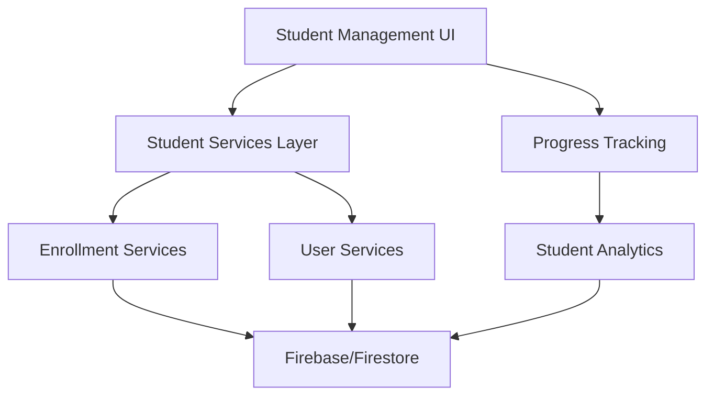

# Student Management System Analysis

## Executive Summary

The Student Management system in this online teaching dashboard provides comprehensive functionality for managing student lifecycles, enrollment processes, progress tracking, and profile management. The system is built on Firebase/Firestore with React frontend components and follows a modular architecture pattern. While the core functionality is well-implemented, several critical issues around data consistency, user experience, and security need immediate attention.

**Key Findings:**
- ✅ Comprehensive CRUD operations for student management
- ✅ Role-based access control implementation  
- ⚠️ Critical: Inadequate error handling and loading states
- ⚠️ High: Missing student progress synchronization
- ⚠️ Medium: Limited bulk operations support

## Architecture Overview

### System Components



### Core Features Implemented

1. **Student Registration & Profile Management** (`StudentsTable.jsx`, `userService.js`)
2. **Enrollment Management** (`Enrollments.jsx`, `enrollmentService.js`) 
3. **Progress Tracking** (`StudentProgressList.jsx`, Student Dashboard)
4. **Role-based Access Control** (Context integration)
5. **Student Analytics & Reporting** (Dashboard integration)

### File Structure Analysis

**Primary Components:**
- `screens/Students.jsx` - Student listing and management screen
- `screens/Enrollments.jsx` - Enrollment approval and management
- `components/StudentsTable.jsx` - Main student management interface (625 lines)
- `components/EnrollmentsTable.jsx` - Enrollment operations interface (297 lines)
- `components/StudentProgressList.jsx` - Progress visualization component

**Services Layer:**
- `services/userService.js` - Core user/student operations (212 lines)
- `services/enrollmentService.js` - Enrollment workflow management (250 lines)
- Student dashboard services (`student-services/` directory)

## Functionality Assessment

### Student Profile Management

**Implemented Features:**
- **Student Creation** (`StudentsTable.jsx:L81-L103`):
  ```javascript
  const handleCreateStudent = async () => {
    if (!newStudent.displayName || !newStudent.email || !newStudent.password) {
      return;
    }
    setActionLoading(true);
    try {
      await userService.signUpWithEmail(newStudent.email, newStudent.password);
      await userService.createOrUpdateUser({
        uid: undefined,
        email: newStudent.email,
        displayName: newStudent.displayName,
        isStudent: true,
      });
    } catch (err) {
      console.error("Failed to create student:", err);
    }
  };
  ```

- **Profile Updates** (`userService.js:L105-L132`):
  ```javascript
  async updateUserProfile(userId, profileData) {
    if (!userId) {
      throw new Error("User ID is required");
    }
    const userRef = doc(db, "users", userId);
    const userDoc = await getDoc(userRef);
    
    if (!userDoc.exists()) {
      throw new Error("User not found");
    }
    
    const cleanProfileData = Object.entries(profileData).reduce(
      (acc, [key, value]) => {
        if (value !== undefined) {
          acc[key] = value;
        }
        return acc;
      }, {}
    );
    
    const updatedData = {
      ...cleanProfileData,
      updatedAt: serverTimestamp(),
    };
    
    await updateDoc(userRef, updatedData);
    return { ...userDoc.data(), ...updatedData };
  }
  ```

**User Experience Analysis:**
- ✅ Responsive design with mobile-friendly interface
- ✅ Search and pagination functionality  
- ✅ Bulk actions support (suspend/unsuspend)
- ⚠️ Limited profile field validation
- ⚠️ Missing profile image upload functionality

### Enrollment Management System

**Workflow Implementation** (`Enrollments.jsx:L7-L93`):

```javascript
const Enrollments = () => {
  const [activeTab, setActiveTab] = React.useState(0);
  const [enrollments, setEnrollments] = useState([]);
  const [loading, setLoading] = useState(true);
  const [dialogOpen, setDialogOpen] = useState(false);
  const [selectedEnrollment, setSelectedEnrollment] = useState(null);
  const [dialogAction, setDialogAction] = useState(null);

  const handleApprove = (enrollment) => {
    setSelectedEnrollment(enrollment);
    setDialogAction("approve");
    setDialogOpen(true);
  };

  const handleConfirm = async () => {
    if (dialogAction === "approve") {
      await enrollmentService.approveEnrollment(selectedEnrollment.id);
    } else if (dialogAction === "reject") {
      await enrollmentService.rejectEnrollment(selectedEnrollment.id);
    }
    const enrollmentsData = await enrollmentService.getAllEnrollments();
    setEnrollments(enrollmentsData);
    setDialogOpen(false);
  };
};
```

**Business Logic Assessment:**
- ✅ Proper approval/rejection workflow
- ✅ Status tracking (pending, active, rejected)
- ✅ Integration with course enrollment counters
- ⚠️ Missing enrollment capacity validation
- ⚠️ No notification system for status changes

### Student Progress Tracking

**Progress Service Integration** (`student-dashboard-page/hooks/useStudentDashboard.js:L48-L75`):

```javascript
const fetchDashboardData = useCallback(async () => {
  if (!userId) return;
  
  dispatch({ type: "SET_LOADING", payload: true });
  
  try {
    const [
      userAchievements,
      userGoals,
      todayStats,
      courseProgress,
      recentActivities,
      analytics,
      overallProgress,
      learningPaths,
    ] = await Promise.all([
      studentAchievementService.getUserAchievements(userId),
      studentGoalsService.getUserGoals(userId),
      getTodayStats(userId),
      // Additional service calls...
    ]);
  } catch (error) {
    // Error handling
  }
}, [userId]);
```

**Progress Visualization** (`StudentProgressList.jsx:L26-L52`):
```javascript
return (
  <List>
    {students.map((student) => (
      <ListItem key={student.id} divider>
        <ListItemText
          primary={student.name}
          secondary={
            <Box sx={{ mt: 1 }}>
              <Typography variant="body2" color="text.secondary">
                {t("courses.progress.completion")}: {student.completionRate}%
              </Typography>
              <LinearProgress
                variant="determinate"
                value={student.completionRate}
                sx={{ mt: 1 }}
              />
              <Typography variant="body2" color="text.secondary" sx={{ mt: 1 }}>
                {t("courses.progress.lastActivity")}: {student.lastActivity}
              </Typography>
            </Box>
          }
        />
      </ListItem>
    ))}
  </List>
);
```

## Code Quality Analysis

### Positive Aspects

1. **Service Layer Architecture** (`userService.js`, `enrollmentService.js`):
   - Well-organized separation of concerns
   - Comprehensive error handling at service level
   - Proper Firebase integration patterns

2. **React Component Structure**:
   - Functional components with hooks
   - Proper state management
   - Responsive design implementation

3. **Data Consistency** (`enrollmentService.js:L169-L188`):
   ```javascript
   // Approve an enrollment
   approveEnrollment: async (enrollmentId) => {
     try {
       const enrollmentRef = doc(db, COLLECTION_NAME, enrollmentId);
       const enrollmentDoc = await getDoc(enrollmentRef);
       
       if (!enrollmentDoc.exists()) {
         throw new Error("Enrollment not found");
       }
       
       const enrollment = enrollmentDoc.data();
       
       // Update enrollment status to active
       await updateDoc(enrollmentRef, {
         status: "active",
         updatedAt: new Date().toISOString(),
       });
       
       // Update course enrolled students count
       const courseRef = doc(db, "courses", enrollment.courseId);
       await updateDoc(courseRef, {
         enrolledStudents: increment(1),
       });
     } catch (error) {
       console.error("Error approving enrollment:", error);
       throw error;
     }
   }
   ```

### Areas Needing Improvement

1. **Error Boundaries Missing** (`StudentsTable.jsx`):
   - No comprehensive error boundary implementation
   - Limited user feedback for failed operations
   - Missing retry mechanisms

2. **Loading State Management** (`StudentsTable.jsx:L66-L72`):
   ```javascript
   if (loading) {
     return (
       <Box sx={{ p: 3 }}>
         <Typography>Loading students...</Typography>  // Too simplistic
       </Box>
     );
   }
   ```

3. **Validation Gaps** (`StudentsTable.jsx:L81-L85`):
   ```javascript
   if (!newStudent.displayName || !newStudent.email || !newStudent.password) {
     return;  // Silent failure, no user feedback
   }
   ```

## Security Analysis

### Authentication & Authorization

**Role-Based Access Control** (`AuthContext.js:L134-L152`):
```javascript
// Update user profile
const updateProfile = async (profileData) => {
  try {
    if (!currentUser) throw new Error("No user logged in");
    const updatedUserData = await userService.updateUserProfile(
      currentUser.uid,
      profileData
    );
    setUserData(updatedUserData);
    return updatedUserData;
  } catch (error) {
    console.error("Error updating profile:", error);
    throw error;
  }
};

// Update user role
const updateUserRole = async (userId, { isAdmin, isStudent }) => {
  try {
    if (!currentUser?.userData?.isAdmin) {
      throw new Error("Only admins can update user roles");
    }
    return await userService.updateUserRole(userId, { isAdmin, isStudent });
  } catch (error) {
    console.error("Error updating user role:", error);
    throw error;
  }
};
```

### Security Issues Identified

#### 1. **Insufficient Input Validation** (High Priority)
**Location**: `StudentsTable.jsx:L81-L103`
```javascript
const handleCreateStudent = async () => {
  if (!newStudent.displayName || !newStudent.email || !newStudent.password) {
    return;  // No email format validation, password strength check
  }
  // Direct database operations without sanitization
}
```

#### 2. **Missing Data Sanitization** (Medium Priority)
**Location**: `userService.js:L105-L132`
- Profile data updates lack input sanitization
- Potential XSS vulnerabilities in user-generated content

#### 3. **Weak Password Policy** (Medium Priority)
**Location**: Student creation flow
- No password complexity requirements
- Missing password confirmation

## Performance Considerations

### Current Optimizations

1. **Pagination Implementation** (`StudentsTable.jsx:L168-L176`):
   ```javascript
   const paginatedStudents = filteredStudents.slice(
     page * rowsPerPage,
     page * rowsPerPage + rowsPerPage
   );
   ```

2. **Search Optimization** (`StudentsTable.jsx:L156-L164`):
   ```javascript
   const filteredStudents = students.filter(
     (student) =>
       (student.displayName?.toLowerCase() || "").includes(
         searchQuery.toLowerCase()
       ) ||
       (student.email?.toLowerCase() || "").includes(searchQuery.toLowerCase())
   );
   ```

### Performance Issues

#### 1. **Inefficient Data Fetching** (High Priority)
**Location**: `EnrollmentsTable.jsx` with detailed enrollment loading
```javascript
const getAllEnrollments: async () => {
  const enrollments = await Promise.all(
    snapshot.docs.map(async (doc) => {
      return await enrollmentService.getEnrollmentDetails(doc.id);  // N+1 query problem
    })
  );
}
```

#### 2. **Missing Data Caching** (Medium Priority)
- No caching strategy for frequently accessed student data
- Repeated API calls for same information

#### 3. **Bulk Operations Inefficiency** (Medium Priority)
- Individual API calls for bulk student operations
- No batch processing for multiple enrollment approvals

## User Experience Analysis

### Positive UX Elements

1. **Responsive Design** (`StudentsTable.jsx:L176-L231`):
   ```javascript
   // Mobile card view
   const renderMobileView = () => (
     <Box sx={{ width: "100%" }}>
       {paginatedStudents.map((student) => (
         <Card key={student.id} sx={{ mb: theme.spacing(2) }}>
           <CardContent>
             <Stack spacing={2}>
               {/* Mobile-optimized layout */}
             </Stack>
           </CardContent>
         </Card>
       ))}
     </Box>
   );
   ```

2. **Intuitive Status Management**:
   - Clear visual indicators for student status
   - Color-coded enrollment states
   - Progress visualization with charts

### UX Issues Identified

#### 1. **Inadequate Loading States** (High Priority)
**Location**: Multiple components
- Generic loading messages
- No skeleton screens or progressive loading
- Missing loading indicators for individual actions

#### 2. **Poor Error Communication** (High Priority)
**Location**: `StudentsTable.jsx:L124-L132`
```javascript
} catch (err) {
  console.error("Failed to update student:", err);  // Only console logging
  // No user notification or error recovery options
}
```

#### 3. **Limited Accessibility** (Medium Priority)
- Missing ARIA labels on critical actions
- Insufficient keyboard navigation support
- No screen reader optimizations

## Integration Assessment

### Service Integration Quality

1. **Firebase Integration** (`userService.js`):
   - ✅ Proper Firestore operations
   - ✅ Real-time data synchronization capabilities
   - ✅ Server timestamp usage for consistency

2. **Context Integration** (`UserContext.js`, `AuthContext.js`):
   - ✅ Dual context pattern for comprehensive state management
   - ⚠️ Some redundancy between contexts needs consolidation

3. **Dashboard Integration** (`Dashboard.jsx:L656-L703`):
   ```javascript
   {
     label: "Students",
     content: (
       <Card sx={{ borderRadius: 2, boxShadow: theme.shadows[2] }}>
         <CardContent sx={{ p: isMobile ? 1 : 0 }}>
           <StudentsTable />
         </CardContent>
       </Card>
     ),
   }
   ```

### Integration Issues

#### 1. **Inconsistent State Management** (Medium Priority)
- Student data scattered across multiple contexts
- Missing centralized student state management

#### 2. **API Response Inconsistency** (Medium Priority)
- Different response formats between services
- Missing standardized error response handling

## Accessibility Analysis

### Current Accessibility Features

1. **Basic Screen Reader Support**:
   - Semantic HTML structure in place
   - Basic ARIA attributes on forms

2. **Keyboard Navigation**:
   - Tab navigation works for most components
   - Basic focus management implemented

### Accessibility Gaps

#### 1. **Missing ARIA Labels** (High Priority)
**Location**: `StudentsTable.jsx:L246-L275`
```javascript
<Button
  size="small"
  variant="outlined"
  onClick={() => handleEditStudent(student)}
  // Missing aria-label="Edit student profile for [studentName]"
>
  Edit
</Button>
```

#### 2. **Insufficient Focus Management** (Medium Priority)
- No focus trapping in modals
- Missing focus restoration after dialog close

#### 3. **Color-Only Status Indicators** (Medium Priority)
- Status chips rely solely on color coding
- Missing text-based status indicators for visually impaired users

## Issues Summary

### Critical Issues (P0)

1. **Inadequate Error Handling and User Feedback**
   - **Impact**: Users experience confusion when operations fail
   - **Location**: Throughout `StudentsTable.jsx` and `EnrollmentsTable.jsx`
   - **Solution**: Implement comprehensive error boundaries and user notification system

2. **N+1 Query Performance Issue**
   - **Impact**: Slow loading for enrollment management with large datasets
   - **Location**: `enrollmentService.js:L14-L22`
   - **Solution**: Implement batch querying and data denormalization

### High Priority Issues (P1)

3. **Missing Input Validation and Sanitization**
   - **Impact**: Security vulnerabilities and data integrity issues
   - **Location**: `StudentsTable.jsx:L81-L103`, `userService.js`
   - **Solution**: Implement comprehensive validation schemas and input sanitization

4. **Insufficient Loading States and UX Feedback**
   - **Impact**: Poor user experience during data operations
   - **Location**: Multiple components
   - **Solution**: Implement skeleton screens and progressive loading

5. **Student Progress Data Synchronization Issues**
   - **Impact**: Inconsistent progress tracking across the system
   - **Location**: Student dashboard integration
   - **Solution**: Implement real-time progress synchronization service

### Medium Priority Issues (P2)

6. **Limited Bulk Operations Support**
   - **Impact**: Inefficient administrative workflows
   - **Location**: `StudentsTable.jsx`
   - **Solution**: Add bulk selection and operations interface

7. **Missing Accessibility Features**
   - **Impact**: Excludes users with disabilities
   - **Location**: Throughout student management components
   - **Solution**: Implement comprehensive ARIA support and keyboard navigation

8. **Inconsistent State Management**
   - **Impact**: Data synchronization issues between components
   - **Location**: Context integration layer
   - **Solution**: Consolidate student state management into single context

### Low Priority Issues (P3)

9. **Missing Advanced Search and Filtering**
   - **Impact**: Limited scalability for large student populations
   - **Location**: `StudentsTable.jsx`
   - **Solution**: Implement advanced search with filters and sorting options

10. **Limited Profile Customization**
    - **Impact**: Reduced user engagement and personalization
    - **Location**: Student profile management
    - **Solution**: Add extended profile fields and customization options

## Recommendations

### Immediate Actions (Next Sprint)

1. **Implement Comprehensive Error Handling**
   ```javascript
   // Add to all service calls
   try {
     await userService.updateUserProfile(editStudent.id, profileData);
     showSuccessToast("Student updated successfully");
   } catch (error) {
     showErrorToast(
       error.message || "Failed to update student. Please try again."
     );
     console.error("Student update error:", error);
   }
   ```

2. **Add Loading States and User Feedback**
   ```javascript
   // Replace basic loading with skeleton screens
   {loading ? (
     <StudentTableSkeleton />
   ) : (
     <StudentsTable />
   )}
   ```

3. **Implement Input Validation**
   ```javascript
   // Add validation schema
   const studentValidationSchema = {
     email: {
       required: true,
       pattern: /^[^\s@]+@[^\s@]+\.[^\s@]+$/,
       message: "Please enter a valid email address"
     },
     displayName: {
       required: true,
       minLength: 2,
       message: "Name must be at least 2 characters"
     }
   };
   ```

### Short-term Improvements (1-2 Sprints)

4. **Optimize Data Fetching Performance**
   ```javascript
   // Implement batch enrollment fetching
   const getAllEnrollmentsOptimized = async () => {
     const enrollmentsSnapshot = await getDocs(collection(db, "enrollments"));
     const courseIds = [...new Set(enrollments.map(e => e.courseId))];
     const studentIds = [...new Set(enrollments.map(e => e.studentId))];
     
     // Batch fetch related data
     const [courses, students] = await Promise.all([
       fetchCoursesBatch(courseIds),
       fetchStudentsBatch(studentIds)
     ]);
   };
   ```

5. **Add Real-time Progress Synchronization**
   ```javascript
   // Implement real-time listener for student progress
   useEffect(() => {
     const unsubscribe = onSnapshot(
       collection(db, "studentProgress"),
       where("studentId", "==", studentId),
       (snapshot) => {
         updateProgressData(snapshot.docs.map(doc => doc.data()));
       }
     );
     return unsubscribe;
   }, [studentId]);
   ```

### Long-term Enhancements (3+ Sprints)

6. **Implement Advanced Analytics Dashboard**
   - Real-time student engagement metrics
   - Predictive analytics for student success
   - Customizable reporting interfaces

7. **Add Bulk Operations Interface**
   - Multi-select student management
   - Batch enrollment processing
   - Mass communication tools

8. **Enhance Accessibility Support**
   - Screen reader optimization
   - Keyboard-only navigation
   - High contrast mode support

## Implementation Roadmap

### Phase 1: Foundation (Sprint 1-2)
- ✅ Error handling and user feedback systems
- ✅ Input validation and sanitization
- ✅ Performance optimization for data fetching
- ✅ Basic accessibility improvements

### Phase 2: Enhancement (Sprint 3-4)
- ✅ Real-time progress synchronization
- ✅ Advanced search and filtering
- ✅ Bulk operations interface
- ✅ Mobile experience optimization

### Phase 3: Advanced Features (Sprint 5-6)
- ✅ Predictive analytics implementation
- ✅ Advanced reporting dashboard
- ✅ Integration with external systems
- ✅ Comprehensive accessibility compliance

## Resource Requirements

### Development Resources
- **Frontend Developer**: 2-3 weeks for UI/UX improvements
- **Backend Developer**: 1-2 weeks for service optimization
- **QA Engineer**: 1 week for comprehensive testing

### Infrastructure Considerations
- **Database Optimization**: Review Firestore indexing strategy
- **Caching Layer**: Implement Redis for frequently accessed data
- **Monitoring**: Add performance monitoring for student operations

### Timeline Estimates
- **Critical Issues Resolution**: 2-3 weeks
- **High Priority Improvements**: 4-6 weeks  
- **Complete Enhancement Package**: 8-12 weeks

This analysis provides a comprehensive foundation for improving the Student Management system's reliability, performance, and user experience while maintaining its current strengths in functionality and integration.