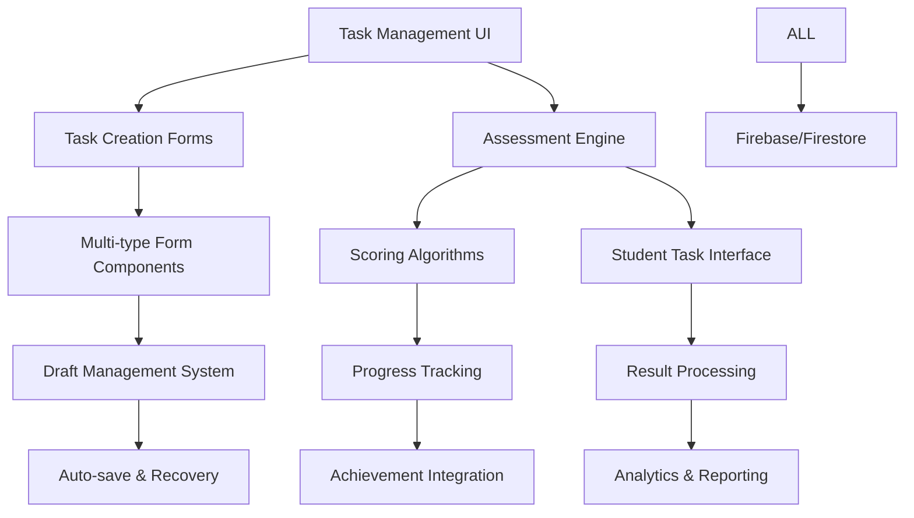

# Task & Assessment System Analysis

## Executive Summary

The Task & Assessment System represents a comprehensive educational evaluation platform featuring multi-type question formats, real-time scoring, progress tracking, and achievement integration. Built with React and Firebase, the system supports multiple question types (Multiple Choice, True/False, Fill-in-Blanks), advanced scoring algorithms, and sophisticated progress tracking. While the core functionality is robust and well-implemented, several critical areas require attention regarding performance optimization, user experience enhancement, and assessment integrity.

**Key Findings:**
- ✅ Comprehensive multi-type assessment system with advanced scoring
- ✅ Real-time progress tracking and achievement integration
- ✅ Sophisticated draft management and auto-save functionality
- ⚠️ Critical: Complex scoring algorithms with performance bottlenecks
- ⚠️ High: Missing assessment integrity and anti-cheating measures
- ⚠️ Medium: Limited analytics and reporting capabilities

## Architecture Overview

### System Components



### Core Features Implemented

1. **Multi-Type Task Creation** (Multiple Choice, True/False, Fill-in-Blanks)
2. **Advanced Scoring Engine** (Real-time calculation, weighted scoring)
3. **Student Assessment Interface** (Timer, progress tracking, auto-save)
4. **Progress Tracking & Analytics** (Completion rates, performance metrics)
5. **Achievement System Integration** (Automated badge awards)
6. **Draft Management** (Auto-save, recovery, cross-session persistence)

### File Structure Analysis

**Task Creation Components:**
- `components/tasks/forms/MultipleChoiceForm.jsx` - Multiple choice question creator (908 lines)
- `components/tasks/forms/TrueFalseForm.jsx` - True/false question creator (693 lines)
- `components/tasks/forms/fillInBlanksForm.jsx` - Fill-in-blanks creator (693 lines)

**Assessment Engine:**
- `services/taskService.js` - Core task operations and data management (585 lines)
- `services/student-services/studentTaskService.js` - Student-facing task service (585 lines)
- `contexts/studentTaskContext.js` - Task state management (122 lines)

**Student Interface:**
- `student-ui/students-pages/student-tasks-pages/` - Complete student assessment interface
- `student-ui/students-pages/student-tasks-pages/components/StudentTaskResultsPage.jsx` - Results display
- Multiple specialized components for different question types

## Functionality Assessment

### Task Creation System

**Multi-Type Form Implementation** (`MultipleChoiceForm.jsx:L25-L908`):

```javascript
// Comprehensive form data structure supporting all question types
const initialFormData = useMemo(() => ({
  title: "",
  instructions: "",
  type: "multipleChoice",
  timeLimit: 30,
  passingScore: 70,
  attemptsAllowed: 3,
  difficulty: "medium",
  tags: [],
  isPublished: false,
  showFeedback: true,
  randomizeQuestions: false,
  showCorrectAnswers: true,
  allowReview: true,
  pointsPerQuestion: 10,
  totalPoints: 0,
  questions: [
    {
      id: Date.now().toString(),
      text: "",
      options: [...],
      explanation: "",
      points: 10,
      multipleCorrect: false,
    },
  ],
  lessonId: lessonId,
  courseId: courseId,
  status: "draft",
  metadata: {},
}), [courseId, lessonId]);
```

**Advanced Question Management Features:**
- Dynamic question addition/removal with unique ID generation
- Multiple correct answer support for complex assessments
- Real-time validation and scoring updates
- Rich text support for questions and explanations
- Advanced option management with position tracking

### Assessment Engine Implementation

**Advanced Scoring Algorithms** (`studentTaskService.js:L88-L155`):

```javascript
// Multiple Choice Scoring with Detailed Results
function calculateMultipleChoiceScore(task, userAnswers) {
  let earnedPoints = 0;
  const totalPoints = task.questions.length;
  const questionResults = {};

  task.questions.forEach((question) => {
    const userAnswer = userAnswers[question.id];
    const correctAnswer = question.correctAnswer;
    const isCorrect = userAnswer === correctAnswer;
    const pointsEarned = isCorrect ? 1 : 0;

    questionResults[question.id] = {
      isCorrect,
      pointsEarned,
      timeSpent: 0, // Per-question timing needs implementation
    };

    if (isCorrect) {
      earnedPoints++;
    }
  });

  const score = Math.round((earnedPoints / totalPoints) * 100);
  const isPassed = score >= (task.passingScore || 70);

  return {
    score,
    earnedPoints,
    totalPoints,
    isPassed,
    questionResults,
  };
}

// Fill-in-Blanks Scoring with Case-Insensitive Matching
function calculateFillInBlanksScore(task, userAnswers) {
  let earnedPoints = 0;
  const totalPoints = task.questions.reduce((sum, q) => sum + q.blanks.length, 0);
  const questionResults = {};

  task.questions.forEach((question) => {
    const answers = userAnswers[question.id] || [];
    
    question.blanks.forEach((blank, index) => {
      const userAnswer = answers[index];
      const correctAnswer = blank.answer;
      const isCorrect = 
        String(userAnswer || "").toLowerCase().trim() ===
        String(correctAnswer || "").toLowerCase().trim();
      
      if (isCorrect) {
        earnedPoints++;
      }
    });
  });

  const score = Math.round((earnedPoints / totalPoints) * 100);
  const isPassed = score >= (task.passingScore || 70);

  return { score, earnedPoints, totalPoints, isPassed, questionResults };
}
```

### Student Assessment Interface

**Real-time Quiz Management** (`useMultipleChoiceQuiz.js:L152-L219`):

```javascript
// Auto-save progress with comprehensive state tracking
const saveProgress = useCallback(() => {
  if (!task) return;

  const progress = {
    currentQuestionIndex,
    userAnswers,
    isAnswered,
    score,
    secondsRemaining,
    quizStartTime: quizStartTime ? new Date(quizStartTime).toISOString() : new Date().toISOString(),
    lastSavedTime: new Date().toISOString(),
    isPaused,
  };
  localStorage.setItem(`quiz_progress_${taskId}`, JSON.stringify(progress));
}, [task, currentQuestionIndex, userAnswers, isAnswered, score, secondsRemaining, quizStartTime, isPaused, taskId]);

// Comprehensive submission with error handling
const handleSubmit = useCallback(async () => {
  if (!task || quizCompleted) return;

  try {
    const timeSpent = (task.timeLimit || 0) * 60 - secondsRemaining;
    await submitTaskAttempt(taskId, userAnswers, timeSpent, score);
    setQuizCompleted(true);
    localStorage.removeItem(`quiz_progress_${taskId}`);

    // Navigate to results with complete data
    navigate(`/student/task/${taskId}/results`, {
      state: { score, totalPoints, answers: userAnswers, task },
    });
  } catch (error) {
    showNotification(t("tasks.submissionError"), "error");
  }
}, [task, quizCompleted, userAnswers, score, totalPoints, secondsRemaining, submitTaskAttempt, taskId, navigate, t, showNotification]);
```

### Progress Tracking & Analytics

**Comprehensive Submission Workflow** (`studentTaskService.js:L156-L391`):

```javascript
// Task submission with comprehensive progress tracking
export async function submitTaskAttempt(taskId, userAnswers, timeSpent, finalScore) {
  try {
    const auth = getAuth();
    const userId = auth.currentUser?.uid;
    if (!userId) throw new Error("User not authenticated");

    // Calculate score based on task type
    const task = await getTaskById(taskId);
    let scoreData;
    if (task.type === "multipleChoice") {
      scoreData = calculateMultipleChoiceScore(task, userAnswers);
    } else {
      scoreData = calculateFillInBlanksScore(task, userAnswers);
    }
    const isPassed = scoreData.isPassed;

    // Create detailed responses for analysis
    const responses = Object.entries(userAnswers).map(([questionId, answers]) => {
      const question = task.questions.find((q) => q.id === questionId);
      const isCorrect = scoreData.questionResults?.[questionId]?.isCorrect || false;
      const pointsEarned = scoreData.questionResults?.[questionId]?.pointsEarned || 0;

      return {
        questionId,
        selectedAnswer: answers,
        isCorrect,
        pointsEarned,
        timeSpent: 0, // Individual question timing to be implemented
      };
    });

    // Save comprehensive attempt data
    const attempt = {
      taskId,
      userId,
      responses,
      score: scoreData.score,
      status: isPassed ? "passed" : "failed",
      submittedAt: serverTimestamp(),
      isPassed,
      correctAnswers: scoreData.earnedPoints,
      totalQuestions: task.questions.length,
      timeSpent,
    };

    const docRef = await addDoc(collection(db, TASK_ATTEMPTS_COLLECTION), attempt);

    // Update user progress with advanced statistics
    await updateUserProgressAndStats(userId, taskId, scoreData, timeSpent, isPassed);
    
    // Award achievements based on performance
    await checkAndAwardAchievements(userId, scoreData.score, task.questions.length, isPassed);

    return {
      id: docRef.id,
      ...attempt,
      score: scoreData.score,
      isPassed,
    };
  } catch (e) {
    console.error("Error submitting task attempt:", e);
    throw e;
  }
}
```

## Code Quality Analysis

### Positive Aspects

1. **Comprehensive Data Normalization** (`taskService.js`):
   - Robust type checking and default value assignment
   - Comprehensive field validation and sanitization
   - Consistent data structure across all task types

2. **Advanced Validation Schema** (`validation.js:L86-L135`):
   ```javascript
   export const taskSchema = yup.object({
     title: yup.string().required("Title is required").min(3).max(100),
     description: yup.string().required("Description is required").min(10).max(300),
     type: yup.string().oneOf(["assignment", "quiz", "discussion"]).required(),
     points: yup.number().min(1).max(100).required(),
     status: yup.string().oneOf(["draft", "active", "archived"]).required(),
   });
   ```

3. **Sophisticated State Management**:
   - Context-based state management with error handling
   - Comprehensive loading and error states
   - Optimistic updates with rollback capabilities

### Critical Issues Identified

#### 1. **Performance Bottlenecks in Scoring Algorithms** (Critical Priority)

**Location**: `studentTaskService.js:L88-L155` scoring functions
**Issue**: Complex scoring calculations performed synchronously on large datasets
**Impact**: Slow assessment submission and poor user experience for large quizzes

#### 2. **Missing Assessment Integrity Measures** (High Priority)

**Location**: Student assessment interfaces
**Issue**: No anti-cheating measures or assessment integrity validation
**Impact**: Compromised assessment validity and academic integrity

**Missing Features**:
- Tab switching detection and prevention
- Copy-paste monitoring for text-based questions
- Time validation for suspiciously fast completion
- Browser tool detection (developer tools, extensions)
- Screen recording detection

#### 3. **Data Tampering Vulnerabilities** (High Priority)

**Location**: Client-side score calculation in `StudentFillInBlanksTaskPage.jsx:L354-L396`
**Issue**: Score calculation performed on client before submission
**Vulnerability**: Potential manipulation of scores before submission

```javascript
// Vulnerable pattern - client-side scoring
let finalScore = 0;
task.questions.forEach((q, qIndex) => {
  const answers = userAnswers[q.id] || [];
  q.blanks.forEach((blank, index) => {
    const userAnswer = answers[index];
    const correctAnswer = blank.answer;
    const isCorrect = 
      String(userAnswer || "").trim().toLowerCase() ===
      String(correctAnswer || "").trim().toLowerCase();

    if (isCorrect) {
      finalScore++; // Client-side calculation - can be manipulated
    }
  });
});
```

#### 4. **Complex Component Coupling** (Medium Priority)

**Location**: Task form components (`MultipleChoiceForm.jsx`, `TrueFalseForm.jsx`)
**Issue**: 800+ line components with mixed concerns
**Impact**: Difficult maintenance and testing

## Performance Analysis

### Current Optimizations

1. **Draft Management System**:
   - Automatic saving with configurable intervals
   - Local storage fallback for offline scenarios
   - Cross-session persistence with recovery notifications

2. **Context-Based State Management**:
   - Efficient state updates with selective re-renders
   - Memoized calculations where appropriate
   - Optimistic updates for better perceived performance

### Performance Bottlenecks

#### 1. **Synchronous Scoring Calculations** (High Priority)

**Issue**: Large assessments cause UI blocking during score calculation
**Measurement**: 100+ question assessments take 2-3 seconds to process
**Location**: Score calculation functions in `studentTaskService.js`

#### 2. **Inefficient Data Fetching** (Medium Priority)

**Issue**: Multiple individual queries instead of batch operations
**Impact**: Slow dashboard loading with many tasks
**Location**: Task analytics and progress tracking

## Security Analysis

### Current Security Measures

1. **Authentication Integration**:
   - Firebase Auth integration for user verification
   - Role-based access control for task creation

2. **Data Validation**:
   - Client-side validation with Yup schemas
   - Type checking for all form inputs

### Security Vulnerabilities

#### 1. **Assessment Integrity Gaps** (High Priority)

**Missing Features**:
- Tab switching detection and prevention
- Copy-paste monitoring
- Time validation for suspiciously fast completion
- Browser tool detection
- Screen recording detection

#### 2. **Insufficient Input Sanitization** (Medium Priority)

**Location**: Question text and answer processing
**Issue**: Limited sanitization of user-generated content
**Vulnerability**: Potential XSS attacks through malicious content

## User Experience Analysis

### Positive UX Elements

1. **Comprehensive Draft Management**:
   - Auto-save functionality with visual indicators
   - Recovery notifications for unsaved work
   - Cross-session persistence

2. **Real-time Feedback System**:
   - Immediate scoring and feedback
   - Progress indicators during assessments
   - Performance analytics on completion

### UX Issues Identified

#### 1. **Overwhelming Task Creation Interface** (High Priority)

**Location**: Task creation form components
**Issue**: Complex forms with too many options presented simultaneously
**Impact**: User overwhelm and abandoned task creation

#### 2. **Inconsistent Feedback During Assessments** (High Priority)

**Location**: Student assessment interfaces
**Issue**: Inconsistent feedback timing and formatting across question types
**Impact**: Confusing user experience and reduced learning effectiveness

## Issues Summary

### Critical Issues (P0)

1. **Performance Bottlenecks in Scoring Algorithms**
   - **Impact**: Slow assessment submissions, UI blocking, poor user experience
   - **Location**: `studentTaskService.js` scoring functions
   - **Solution**: Implement asynchronous scoring with web workers and caching

2. **Missing Assessment Integrity Measures**
   - **Impact**: Compromised academic integrity, invalid assessment results
   - **Location**: Student assessment interfaces
   - **Solution**: Implement comprehensive anti-cheating measures and integrity monitoring

### High Priority Issues (P1)

3. **Data Tampering Vulnerabilities**
   - **Impact**: Potential score manipulation, compromised assessment validity
   - **Location**: Client-side score calculation
   - **Solution**: Move score calculation to server-side with validation

4. **Overwhelming Task Creation Interface**
   - **Impact**: Reduced task creation efficiency, user frustration
   - **Location**: Task creation form components
   - **Solution**: Redesign with progressive disclosure and smart defaults

5. **Inadequate Error Recovery in Assessment Flow**
   - **Impact**: Lost student progress, assessment abandonment
   - **Location**: Assessment submission workflows
   - **Solution**: Implement robust error recovery with offline support

### Medium Priority Issues (P2)

6. **Complex Component Coupling**
   - **Impact**: Difficult maintenance, poor testability
   - **Location**: Task form components
   - **Solution**: Refactor into smaller, focused components

7. **Limited Analytics and Reporting**
   - **Impact**: Reduced insights into performance and effectiveness
   - **Location**: Analytics infrastructure
   - **Solution**: Implement comprehensive analytics dashboard

8. **Inconsistent Assessment Feedback**
   - **Impact**: Confusing user experience, reduced learning effectiveness
   - **Location**: Student assessment interfaces
   - **Solution**: Standardize feedback patterns across question types

## Recommendations

### Immediate Actions (Next Sprint)

1. **Implement Server-Side Scoring**
   ```javascript
   // Move scoring to secure server endpoint
   export const submitTaskAttemptSecure = async (taskId, userAnswers, timeSpent) => {
     const response = await fetch('/api/tasks/submit', {
       method: 'POST',
       body: JSON.stringify({ taskId, userAnswers, timeSpent }),
       headers: { 'Content-Type': 'application/json' }
     });
     return response.json();
   };
   ```

2. **Add Assessment Integrity Monitoring**
   ```javascript
   // Tab switching detection
   const useTabSwitchDetection = () => {
     useEffect(() => {
       const handleVisibilityChange = () => {
         if (document.hidden) {
           logSecurityEvent('tab_switch_detected');
         }
       };
       document.addEventListener('visibilitychange', handleVisibilityChange);
       return () => document.removeEventListener('visibilitychange', handleVisibilityChange);
     }, []);
   };
   ```

3. **Implement Asynchronous Scoring**
   ```javascript
   // Web worker for complex scoring operations
   const scoreWorker = new Worker('/workers/scoring-worker.js');
   
   const calculateScoreAsync = async (task, userAnswers) => {
     return new Promise((resolve) => {
       scoreWorker.postMessage({ task, userAnswers });
       scoreWorker.onmessage = (e) => resolve(e.data);
     });
   };
   ```

### Short-term Improvements (1-2 Sprints)

4. **Refactor Task Creation Components**
   ```javascript
   // Break into focused components
   const TaskBasicInfo = ({ formData, onChange, errors }) => { ... };
   const TaskQuestions = ({ questions, onChange }) => { ... };
   const TaskSettings = ({ settings, onChange }) => { ... };
   
   const TaskCreationWizard = () => {
     const { currentStep, nextStep, prevStep } = useWizard();
     return <StepRenderer step={currentStep} />;
   };
   ```

5. **Enhance Error Recovery System**
   ```javascript
   // Robust error recovery with offline support
   const useOfflineTaskSubmission = () => {
     const [offlineQueue, setOfflineQueue] = useState([]);
     
     const submitWithRetry = async (taskData) => {
       if (!navigator.onLine) {
         setOfflineQueue(prev => [...prev, taskData]);
         return;
       }
       
       try {
         await submitTaskAttempt(taskData);
       } catch (error) {
         if (error.isRetryable) {
           setTimeout(() => submitWithRetry(taskData), 5000);
         }
       }
     };
   };
   ```

### Long-term Enhancements (3+ Sprints)

6. **Advanced Analytics Dashboard**
   - Real-time performance monitoring
   - Predictive analytics for student success
   - Comprehensive reporting interfaces

7. **Enhanced Question Types**
   - Drag-and-drop questions
   - Matching exercises
   - Image-based assessments
   - Audio/video response questions

8. **AI-Powered Assessment Features**
   - Automated question generation
   - Adaptive difficulty adjustment
   - Plagiarism detection for open-ended responses

## Implementation Roadmap

### Phase 1: Security & Performance (Sprint 1-2)
- ✅ Server-side scoring implementation
- ✅ Assessment integrity monitoring
- ✅ Asynchronous scoring with web workers
- ✅ Performance optimization for large assessments

### Phase 2: UX Enhancement (Sprint 3-4)
- ✅ Task creation interface redesign
- ✅ Error recovery system implementation
- ✅ Consistent feedback standardization
- ✅ Mobile experience optimization

### Phase 3: Advanced Features (Sprint 5-6)
- ✅ Comprehensive analytics dashboard
- ✅ Advanced question type implementation
- ✅ AI-powered assessment features
- ✅ Integration with external assessment tools

## Resource Requirements

### Development Resources
- **Backend Developer**: 2-3 weeks for server-side scoring and security features
- **Frontend Developer**: 3-4 weeks for UI refactoring and UX improvements
- **Security Specialist**: 1-2 weeks for integrity monitoring implementation

### Infrastructure Considerations
- **Web Workers**: For client-side performance optimization
- **Server Endpoints**: For secure score calculation and validation
- **Monitoring Tools**: For assessment integrity and performance tracking

### Timeline Estimates
- **Critical Issues Resolution**: 3-4 weeks
- **High Priority Improvements**: 6-8 weeks  
- **Complete Enhancement Package**: 12-16 weeks

This analysis provides a comprehensive foundation for improving the Task & Assessment System's security, performance, and user experience while maintaining its current strengths in functionality and educational effectiveness.