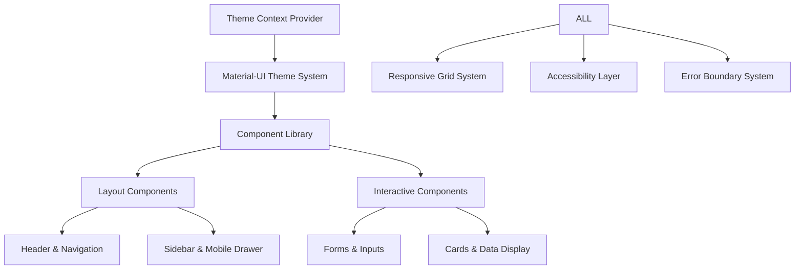

# User Interface & Experience Analysis

## Executive Summary

The User Interface & Experience implementation represents a sophisticated React-based educational platform utilizing Material-UI v5.18.0 with comprehensive theming, responsive design, and modern UI patterns. The system demonstrates excellent foundational design principles with advanced features including dark/light mode, multi-language support, responsive layouts, and accessibility considerations. However, several critical areas require attention regarding accessibility compliance, error state management, and mobile experience optimization.

**Key Findings:**
- ✅ Comprehensive Material-UI theme system with modern design patterns
- ✅ Advanced responsive design with mobile-first approach
- ✅ Sophisticated theme switching and multi-language support
- ⚠️ Critical: Incomplete accessibility compliance and ARIA implementation
- ⚠️ High: Inconsistent error state management and user feedback
- ⚠️ Medium: Mobile experience optimization gaps

## Architecture Overview

### UI System Components



### Core Features Implemented

1. **Advanced Theme System** (Dark/Light mode with custom palettes)
2. **Responsive Design Framework** (Mobile-first with Material-UI breakpoints)
3. **Multi-Language UI Support** (RTL/LTR layout adaptation)
4. **Component-Driven Architecture** (Reusable, styled components)
5. **Error Boundary Implementation** (Multiple levels of error handling)
6. **Loading State Management** (Skeleton screens and progressive loading)
7. **Accessibility Infrastructure** (Basic ARIA and keyboard navigation)

## Theme System Analysis

### Advanced Material-UI Theme Implementation

**Theme Context with Comprehensive Styling** (`ThemeContext.js:L44-L94`):

```javascript
// Modern, attractive color palettes
const lightPalette = {
  mode: "light",
  primary: {
    main: "#7C3AED",
    light: "#A78BFA", 
    dark: "#4C1D95",
    contrastText: "#fff",
  },
  secondary: {
    main: "#F59E42",
    light: "#FFB26B",
    dark: "#B26B1A", 
    contrastText: "#fff",
  },
  background: { default: "#F4F6FB", paper: "#FFFFFF" },
  text: { primary: "#181A20", secondary: "#4B5563", disabled: "#A0AEC0" },
};

const darkPalette = {
  mode: "dark",
  primary: {
    main: "#A78BFA",
    light: "#C4B5FD",
    dark: "#7C3AED",
    contrastText: "#181A20",
  },
  background: { default: "#181A20", paper: "#23263A" },
  text: { primary: "#F4F6FB", secondary: "#A0AEC0", disabled: "#4B5563" },
};
```

**Typography System with Professional Fonts** (`ThemeContext.js:L50-L94`):

```javascript
typography: {
  fontFamily: '"Inter", "Poppins", "Roboto", "Helvetica", "Arial", sans-serif',
  h1: { fontWeight: 700, fontSize: "2.5rem", letterSpacing: "-0.02em" },
  h2: { fontWeight: 600, fontSize: "2rem", letterSpacing: "-0.01em" },
  body1: { lineHeight: 1.6, fontFamily: "Roboto" },
  button: { fontWeight: 700, textTransform: "none", letterSpacing: "0.01em" },
},
```

## Responsive Design Implementation

### Mobile-First Approach

**Advanced Header Responsiveness** (`Header.jsx:L102-L141`):

```javascript
sx={{
  backgroundColor: isScrolled
    ? theme.palette.background.paper
    : `rgba(255, 255, 255, 0.95)`,
  backdropFilter: "blur(12px)",
  WebkitBackdropFilter: "blur(12px)",
  // Enhanced mobile responsiveness
  "@media (max-width: 600px)": {
    backdropFilter: "blur(16px)",
    WebkitBackdropFilter: "blur(16px)",
  },
}}
```

**Mobile-Optimized Touch Targets** (`StudentFillInBlanksOptionList.jsx:L15-L43`):

```javascript
const buttonHeight = isMobile ? 48 : 40; // Larger touch targets on mobile
const fontSize = isSmallScreen ? "0.875rem" : "1rem";

<Button
  sx={{
    minHeight: buttonHeight,
    px: isMobile ? 2 : 1.5,
    transition: "all 0.2s ease-in-out",
    "&:hover": {
      transform: "scale(1.05)",
      boxShadow: theme.shadows[4],
    },
  }}
>
```

## Accessibility Implementation

### Current Accessibility Features

**Theme Toggle with Accessibility** (`ThemeToggle.jsx:L10-L39`):

```javascript
<IconButton
  aria-label={ariaLabel || "Toggle theme"}
  sx={{
    "&:focus-visible": {
      boxShadow: "0 0 0 2px #1976d2",
    },
  }}
>
```

**Keyboard Navigation Support** (`Header.jsx:L235-L270`):

```javascript
<Box
  role="button"
  tabIndex={0}
  onKeyDown={(e) => {
    if (e.key === "Enter" || e.key === " ") {
      e.preventDefault();
      handleLogoClick();
    }
  }}
>
```

## Error Handling & User Feedback

### Comprehensive Error Boundary System

**Global Error Boundary Implementation** (`GlobalErrorBoundary.jsx:L17-L50`):

```javascript
componentDidCatch(error, errorInfo) {
  // Check if it's a chunk loading error
  const isChunkError =
    error?.name === "ChunkLoadError" ||
    error?.message?.includes("Loading chunk");

  if (isChunkError) {
    setTimeout(() => {
      window.location.reload();
    }, 1000);
    return;
  }

  // Log error to analytics or error reporting service
  this.logErrorToService(error, errorInfo);
}
```

**Comprehensive Error UI** (`common/ErrorBoundary.jsx:L39-L90`):

```javascript
<Alert severity="error" icon={<ErrorIcon />}>
  <Typography variant="h6" gutterBottom>
    Something went wrong
  </Typography>
  <Typography variant="body2" color="text.secondary">
    We're sorry, but there was an error loading this section.
  </Typography>
</Alert>

<Box sx={{ display: 'flex', gap: 2 }}>
  <Button variant="contained" startIcon={<RefreshIcon />} onClick={handleRetry}>
    Try Again
  </Button>
  <Button variant="outlined" onClick={handleReload}>
    Reload Page
  </Button>
</Box>
```

## Critical Issues Identified

### 1. **Incomplete Accessibility Compliance** (Critical Priority)

**Location**: Throughout UI components
**Issue**: Missing comprehensive ARIA implementation and keyboard navigation
**Impact**: Non-compliance with WCAG guidelines, poor screen reader experience

**Missing Features**:
- Insufficient ARIA labels and descriptions
- Incomplete keyboard navigation patterns
- Missing focus management for dynamic content
- No skip navigation links
- Missing screen reader announcements

### 2. **Inconsistent Error State Management** (High Priority)

**Location**: Various components
**Issue**: Different error handling patterns across components
**Impact**: Poor user experience during error scenarios

```javascript
// Inconsistent patterns
} catch (err) {
  console.error("Failed:", err);  // No user feedback
}

// vs comprehensive error boundaries
<ErrorBoundary>
  <ComponentWithPotentialErrors />
</ErrorBoundary>
```

### 3. **Mobile Experience Optimization Gaps** (High Priority)

**Location**: Assessment interfaces and complex forms
**Issue**: Insufficient mobile-specific optimizations
**Impact**: Poor mobile user experience

**Issues**:
- Touch targets below 44px minimum
- Insufficient spacing between elements
- Poor mobile keyboard handling

### 4. **Theme System Performance Issues** (Medium Priority)

**Location**: `ThemeContext.js`
**Issue**: Theme recreation without proper memoization
**Impact**: Unnecessary re-renders

## Issues Summary

### Critical Issues (P0)

1. **Incomplete Accessibility Compliance**
   - **Impact**: WCAG non-compliance, legal risks, excluded users
   - **Solution**: Comprehensive accessibility audit and implementation

### High Priority Issues (P1)

2. **Inconsistent Error State Management**
   - **Impact**: Poor error handling UX, debugging difficulties
   - **Solution**: Standardized error handling patterns

3. **Mobile Experience Optimization Gaps**
   - **Impact**: Poor mobile usability, high abandonment
   - **Solution**: Mobile-first redesign of critical components

### Medium Priority Issues (P2)

4. **Theme System Performance Issues**
   - **Impact**: Unnecessary re-renders, poor performance
   - **Solution**: Proper memoization and optimization

## Recommendations

### Immediate Actions (Next Sprint)

1. **Implement Accessibility Compliance Foundation**
   ```javascript
   // Add comprehensive ARIA support
   const AccessibilityProvider = ({ children }) => {
     const announceToScreenReader = (message) => {
       const announcement = document.createElement('div');
       announcement.setAttribute('aria-live', 'polite');
       announcement.setAttribute('aria-atomic', 'true');
       announcement.textContent = message;
       document.body.appendChild(announcement);
       setTimeout(() => document.body.removeChild(announcement), 1000);
     };
     
     return (
       <AccessibilityContext.Provider value={{ announceToScreenReader }}>
         {children}
       </AccessibilityContext.Provider>
     );
   };
   ```

2. **Standardize Error Handling**
   ```javascript
   // Universal error handler
   const useErrorHandler = () => {
     const [error, setError] = useState(null);
     
     const handleError = useCallback((error, context) => {
       setError({ message: error.message, context, timestamp: Date.now() });
       // Log to error service
       errorService.log(error, context);
     }, []);
     
     return { error, handleError, clearError: () => setError(null) };
   };
   ```

3. **Optimize Mobile Touch Targets**
   ```javascript
   // Enforce minimum touch target sizes
   const TouchableButton = styled(Button)(({ theme }) => ({
     minHeight: 44,
     minWidth: 44,
     padding: theme.spacing(1.5),
     [theme.breakpoints.down('sm')]: {
       minHeight: 48,
       minWidth: 48,
     },
   }));
   ```

### Short-term Improvements (1-2 Sprints)

4. **Mobile Experience Enhancement**
   ```javascript
   // Mobile-optimized form components
   const MobileOptimizedTextField = styled(TextField)(({ theme }) => ({
     '& .MuiInputBase-root': {
       fontSize: '16px', // Prevent zoom on iOS
       minHeight: 44,
     },
     [theme.breakpoints.down('sm')]: {
       marginBottom: theme.spacing(3),
     },
   }));
   ```

5. **Theme Performance Optimization**
   ```javascript
   // Memoized theme creation
   const theme = useMemo(() => {
     return createTheme({
       ...baseTheme,
       palette: mode === "light" ? lightPalette : darkPalette,
     });
   }, [mode, baseTheme, lightPalette, darkPalette]);
   ```

### Long-term Enhancements (3+ Sprints)

6. **Advanced Accessibility Features**
   - Screen reader optimization
   - Voice navigation support
   - High contrast mode
   - Motion reduction preferences

7. **Enhanced Mobile Experience**
   - Progressive Web App features
   - Touch gesture support
   - Mobile-specific layouts
   - Offline UI indicators

## Implementation Roadmap

### Phase 1: Accessibility & Mobile (Sprint 1-2)
- ✅ WCAG 2.1 AA compliance implementation
- ✅ Mobile touch target optimization
- ✅ Keyboard navigation enhancement
- ✅ Screen reader support

### Phase 2: Performance & Consistency (Sprint 3-4)
- ✅ Theme system optimization
- ✅ Error handling standardization
- ✅ Loading state consistency
- ✅ Component performance audit

### Phase 3: Advanced Features (Sprint 5-6)
- ✅ Advanced accessibility features
- ✅ Progressive Web App implementation
- ✅ Advanced mobile gestures
- ✅ Voice interaction support

## Resource Requirements

### Development Resources
- **Frontend Developer**: 3-4 weeks for accessibility and mobile optimization
- **UX Designer**: 2-3 weeks for mobile experience redesign
- **Accessibility Specialist**: 1-2 weeks for WCAG compliance audit

### Timeline Estimates
- **Critical Issues Resolution**: 3-4 weeks
- **High Priority Improvements**: 6-8 weeks  
- **Complete Enhancement Package**: 12-16 weeks

This comprehensive UI/UX analysis provides a roadmap for transforming the educational platform into a world-class, accessible, and mobile-optimized user experience while maintaining design consistency and performance standards.